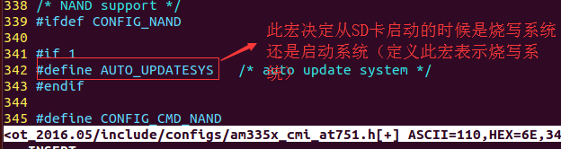
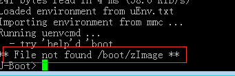
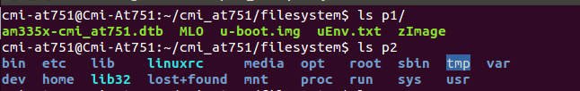

# SD启动

 <div>01 修改uboot的源码，支持SD卡启动</div>




* [传参的文件地址](https://note.youdao.com/share/?id=5e827bbf1bee1bd82a233db9d92d2a01&type=note#/)

<div>02 从外界给uboot传参数</div>

```sh
  cat uEnv.txt
  bootargs=console=ttyO0,115200n8 init=/sbin/init root=/dev/mmcblk0p2 rw rootfstype=ext4 mem=512M vram=50M
  bootcmd=fatload mmc 0 ${fdtaddr} am335x-cmi_at751.dtb;fatload mmc 0 ${loadaddr} zImage;bootz ${loadaddr} - ${fdtaddr}
  uenvcmd=boot

 注意：此文件（uEnv.txt）的格式要正确，否则显示： File not found /boot/zImage
```



<div>03 sd分区内容的拷贝（my_sd.sh）</div>

<div>cat my_sd.sh</div>

```sh
#!/bin/sh

sudo losetup -f --show  cmi_at751.img
sudo kpartx  -av /dev/loop0

sleep 2
mkdir p1 p2
sudo mount /dev/mapper/loop0p1  p1
sudo mount /dev/mapper/loop0p2  p2

sudo rm p2/* -rf
sync

sudo cp /home/sbc_7109_454_pdk3/aplex/filesystem/rootfs/*  p2  -rf
#sudo cp /home/sbc_7109_454_pdk3/aplex/filesystem/rootfs_pcie/*  p2  -rf
sudo cp  uEnv.txt  u-boot.img MLO  am335x-sbc7109.dtb zImage  p1/ -rf

sleep 2

sync
sudo umount p1 p2
sudo kpartx  -d /dev/loop0
sudo losetup -d /dev/loop0

sleep 2
```

* [cmi_at751.img的制作](CrossCompiler.md)

```sh
  注意：SD卡启动的cmi_at751.img 和SD卡烧写所用到的 cmi_at751.img 的制作步骤是一样的。但是对于SD卡启动来说，cmi_at751.img的第二个分区需要存放根文件系统，所以需要分配较大的存储空间。
```

<div>SD卡启动，cmi_at751.img的两个分区的内容</div>

