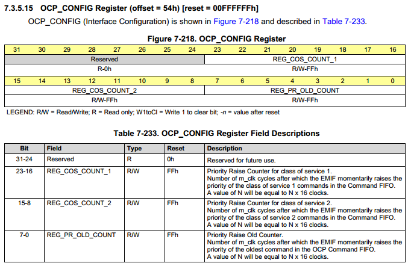

# TI-sgx驱动配置

* 01 参考资料
  *  [富林](http://www.cnblogs.com/chenfulin5/p/7245590.html)
  * [lcdc模块配](http://processors.wiki.ti.com/index.php/Linux_Core_LCD_Controller_User_Guide?keyMatch=DRM&tisearch=Search-EN)
  * [DSS模块配置](http://processors.wiki.ti.com/index.php/Linux_Core_DSS_User%27s_Guide)

* 02 内核配置

```sh
CONFIG_DRM=y/m
CONFIG_DRM_I2C_NXP_TDA998X=y/m
CONFIG_DRM_TILCDC=y/m
CONFIG_DRM_OMAP=y/m
```

* 03 给uboot打补丁

```sh
说明：
  给EMIF OCP_CONFIG registers 中的 REG_COS_COUNT_1, REG_COS_COUNT_2 赋值），补丁文件内容如下（https://lists.denx.de/pipermail/u-boot/2016-December/275681.html）
```
<div>OCP_CONFIG 寄存器简介</div>



```sh
  REG_COS_COUNT_1: 提高服务类1中任务的优先级
  REG_COS_COUNT_2：提高服务类2中任务的优先级
  REG_PR_OLD_COUNT:提高命令缓冲区中任务的优先级（提供了OCP命令FIFO中最老的命令的超时值，以提升和执行。这有助于避免连续阻塞事件）
```

* 04 编译SGX的驱动模块

```sh
本模块以以PDK 3.0为例
参考链接：http://software-dl.ti.com/processor-sdk-linux/esd/AM335X/03_03_00_04/index_FDS.html

 在适当位置编写Makefile 文件，步骤和内容如下
    （参考：ti-processor-sdk-linux-am335x-evm-03.03.00.04/Makefile--->271行 ti-sgx-ddk-km: linux）：
 cd  ti_sdk/board-support/extra-drivers/ti-sgx-ddk-km-1.14.3699939
 cat Makefile
export LINUXKERNEL_INSTALL_DIR=/home/sbc_7109_454_pdk3/aplex/board-support/linux-kernel-source-code/kernel_4.4.12
export SDK_PATH_TARGET=/home/sbc_7109_454_pdk3/ti_sdk/linux-devkit/sysroots/armv7ahf-neon-linux-gnueabi
#export DESTDIR=/home/sbc_7109_454_pdk3/test/qt5_rootfs
export DESTDIR=/home/sbc_7109_454_pdk3/test/root_test

all:
        make -C ./eurasia_km/eurasiacon/build/linux2/omap_linux \
        ARCH=arm TARGET_PRODUCT=ti335x KERNELDIR=$(LINUXKERNEL_INSTALL_DIR)

clean:
    make -C ./eurasia_km/eurasiacon/build/linux2/omap_linux \
        ARCH=arm TARGET_PRODUCT=ti335x KERNELDIR=$(LINUXKERNEL_INSTALL_DIR) clean

install:
    cd ./eurasia_km/eurasiacon/binary2_omap_linux_release/target/kbuild; \
    make -C $(LINUXKERNEL_INSTALL_DIR) SUBDIRS=`pwd` INSTALL_MOD_PATH=$(DESTDIR) PREFIX=$(SDK_PATH_TARGET) INSTALL_MOD_STRIP=1 modules_install

```

* 05 编译与安装

```sh
  make && make install (生成bc_example.ko和pvrsrvkm.ko两个内核模块)
```

* 06 在arm板上搭建上述两个模块的运行环境

```sh
a 解压ti-processor-sdk-linux-am335x-evm-03.03.00.04/filesystem/tisdk-rootfs-image-am335x-evm.tar.xz压缩文件。
    cd ti-processor-sdk-linux-am335x-evm-03.03.00.04/filesystem
    mkdir test
    tar xvf tisdk-rootfs-image-am335x-evm.tar.xz -C test

b 拷贝相关文件到开发板的根文件系统中去，为了方便操作，创建如下脚本文件：
cat  sgx_lib_cp.sh
#! /bin/sh
lib_src=/home/am335x/ti-processor-sdk-linux-am335x-evm-03.03.00.04/filesystem/test
lib_des=/home/am335x/aplex/cmi_at751/filesystem/buildroot_rootfs

sudo cp $lib_src/etc/init.d/rc.pvr         $lib_des/etc/init.d/ -rf
sudo cp $lib_src/usr/bin/pvrsrvctl       $lib_des/usr/bin/pvrsrvctl -rf
sudo cp $lib_src/usr/lib/libwayland*    $lib_des/usr/lib/ -rf
sudo cp $lib_src/usr/lib/libattr.*           $lib_des/usr/lib/ -rf
sudo cp $lib_src/usr/lib/libGLES*        $lib_des/usr/lib/ -rf
sudo cp $lib_src/usr/lib/gbm/              $lib_des/usr/lib/ -rf
sudo cp $lib_src/usr/lib/libpvr*            $lib_des/usr/lib/ -rf
sudo cp $lib_src/usr/lib/libdrm*           $lib_des/usr/lib/ -rf
sudo cp $lib_src/usr/lib/libgbm.*         $lib_des/usr/lib/ -rf
sudo cp $lib_src/usr/lib/libudev.*         $lib_des/usr/lib/ -rf
sudo cp $lib_src/usr/lib/libsrv_*           $lib_des/usr/lib/ -rf
sudo cp $lib_src/usr/lib/libEGL*           $lib_des/usr/lib/ -rf
sudo cp $lib_src/usr/lib/libIMGegl*       $lib_des/usr/lib/ -rf
sudo cp $lib_src/usr/lib/libdbm*            $lib_des/usr/lib/ -rf
sudo cp $lib_src/usr/lib/libglslcompiler*  $lib_des/usr/lib/ -rf
sudo cp $lib_src/usr/lib/libpthread*       $lib_des/usr/lib/ -rf
sudo cp $lib_src/usr/lib/libusc*              $lib_des/usr/lib/ -rf
sudo cp $lib_src/lib/libudev.*                 $lib_des/lib/ -rf
sudo cp $lib_src/usr/bin/modetest        $lib_des/usr/bin -rf
sudo cp $lib_src/usr/bin/kms*               $lib_des/usr/bin -rf
sudo cp $lib_src/lib/libattr.*                   $lib_des/lib/ -rf
sudo cp $lib_src/lib/libcap.so*               $lib_des/lib/ -rf && echo ok
```

* 07 加载内核模块

```sh
/etc/init.d/rc.pvr start  (bc_example.ko和pvrsrvkm.ko两个内核模块，用lsmod查看结果)
kmscube （执行测试程序，效果图如下图）
```


