# buildroot的配置与使用
## 00 目录
* [01 buildroot环境搭建](#jump01)
* [02 buildroot扩展](#jump02)

## <span id="jump01">01 buildroot环境搭建
[buildroot官方文档](https://buildroot.org/downloads/manual/manual.html)
* 操作系统：Ubuntu 14.04

```sh
  buildroot的sysroot目录：output/host/usr/arm-buildroot-linux-gnueabihf/sysroot
```
```sh
  1. 如果交叉编译工具链是32位，需要下载32位的依赖库
    sudo apt-get install   libc6:i386   libstdc++6:i386   libncurses5:i386 zlib1g:i386

  2. 安装buildroot
    sudo apt-get update –y
    wget  https://buildroot.org/downloads/buildroot-2017.02.3.tar.gz
    tar xvf buildroot-2017.02.3.tar.gz
    sudo apt-get install texinfo  -y
    sudo apt-get install libncurses5-dev -y
    sudo add-apt-repository ppa:webupd8team/java  -y
    sudo apt-get update
    sudo apt-get install oracle-java8-installer -y
    sudo apt-get install oracle-java8-set-default -y
  3. buildroot的下载地址
    https://buildroot.org/downloads/
```
* 根据arm架构配置buildroot

```sh
  1. 打开buildroot的配置界面
    make menuconfig
    make busybox-menuconfig
  2. 界面配置如下图所示。
```
* Buildroot 简介

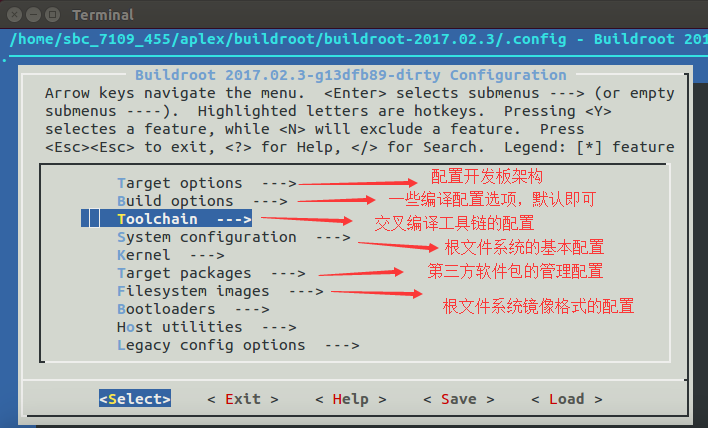

* 配置开发板架构

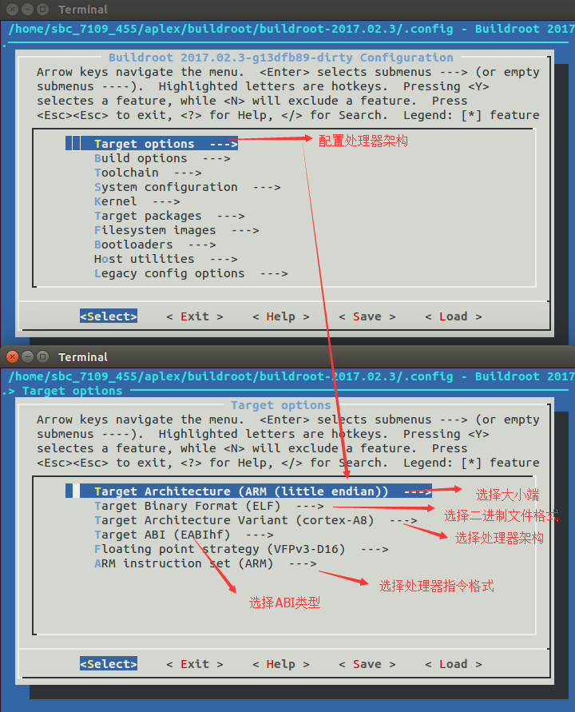

* 配置外部交叉编译工具链

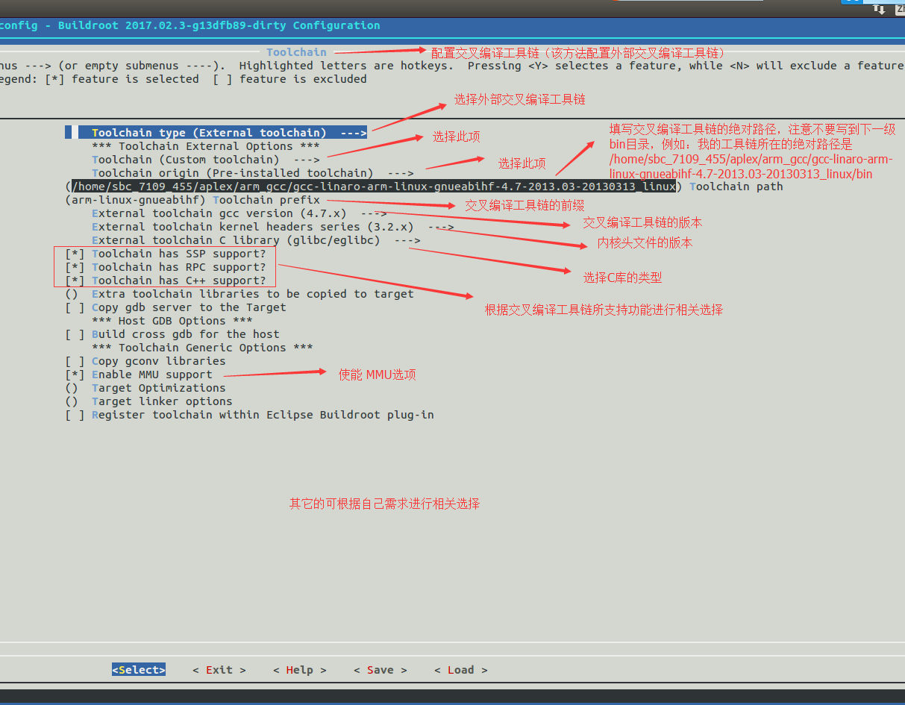

* 配置 根文件系统选项

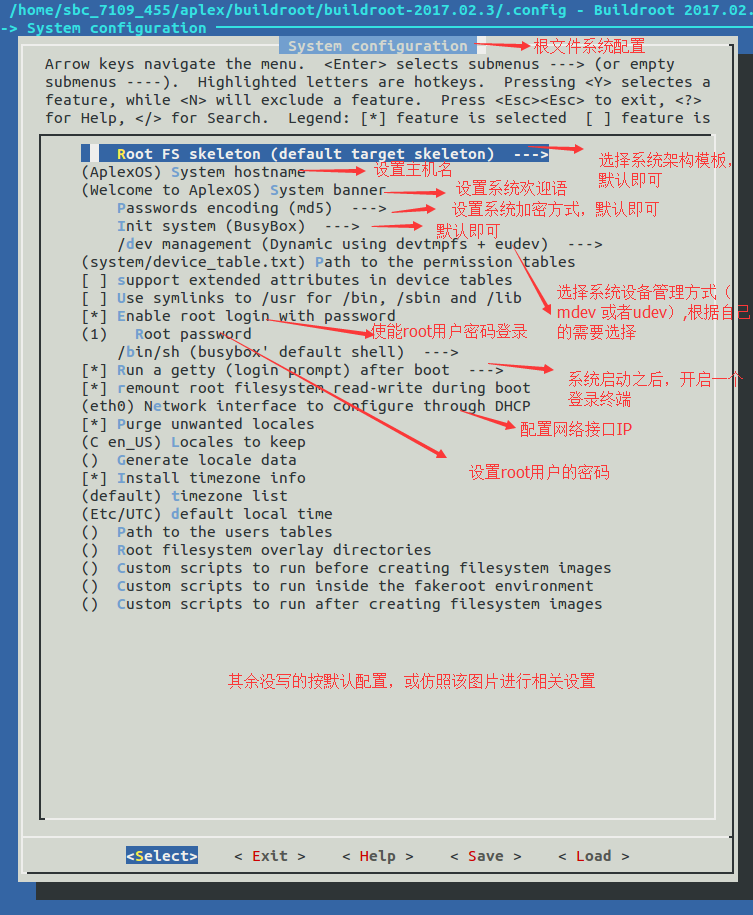

* 根文件系统压缩包的压缩方式

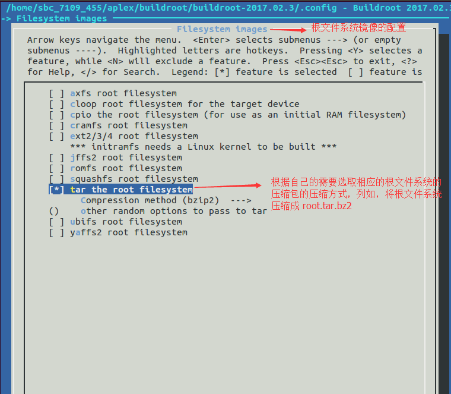

# <span id="jump02">02 buildroot 扩展
* 2.1 添加自己的软件包
  * 1. 我有一个软件包（uart1）

  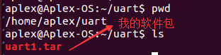

  * 2. 将我的软件包添加到buildroot中

  ```sh
    1. 在buildroot中创建软件包的配置信息
      在buildroot/package/ 下执行 mkdir  uart1 ，创建uart1 的文件夹
      在uart1 文件夹下面建立两个配置文件Config.in 和 uart1.mk

      在uart1.mk文件中添加如下内容
          UART1_SOURCE = uart1.tar //软件包名
          UART1_SITE = file:///home/aplex //软件包所在的位置
          define UART1_BUILD_CMDS     //编译命令
                  $(MAKE)   -C $(@D)    //调到我的uart1软件包里面执行uart1里面的Mkaefile文件
          endef
          define UART1_INSTALL_TARGET_CMDS    // 安装命令
                  $(INSTALL) -D -m 755 $(@D)/lws_uart  $(TARGET_DIR)/bin
          endef
          $(eval $(generic-package))

      在Config.in 文件中添加如下内容
          config BR2_PACKAGE_UART1
                     bool"uart1"
          default y
                     select BR2_PACKAGE_LIBWEBSOCKETS //本软件所依赖的库
                     select BR2_PACKAGE_JSONCPP
                     help
                       demo app to show  

      2. 将uart1注册到buildroot系统中
          在package/Config.in 中加入 source "package/demo_app/Config.in" ，以便将uart1 的配置文件包含到Buildroot的package中来管理
      3. 参考案列：
        Config.in文件的仿照案例，在buildroot-2017.02.3/package目录下随便找一篇文档即可参照。
        uart1.mk文件的仿照案例：
          1 generic-package ：参考文件package/vsftpd/vsftpd.mk：
          2：autotools-package ： grep "autotools-package"  package/  -r
          3：cmake-package ：grep "cmake-package"  package/  -r
          4：python-package：grep python-package""  package/  -r
        网址参考介绍：
        TSLIB_SITE = https://github.com/kergoth/tslib/releases/download/$(TSLIB_VERSION)
        UART1_SITE = file:///home/aplex 或者 /home/aplex
        LIBFOO_SITE = http://www.foosoftware.org/download
        使用git网址：将未压缩的软件源码上传到githup上，创建发布版本，即可在buildroot中使用git下载源码包，如下图
  ```

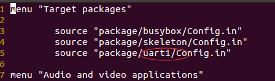

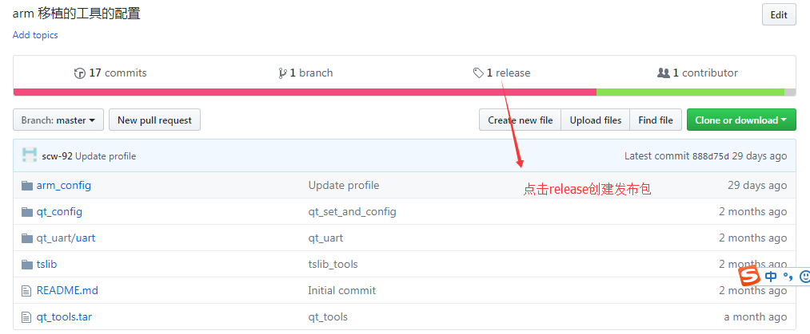

* 2.2 合并新老系统[参考地址](https://github.com/ZengjfOS/Buildroot/tree/master/customize/rootfs/etc)

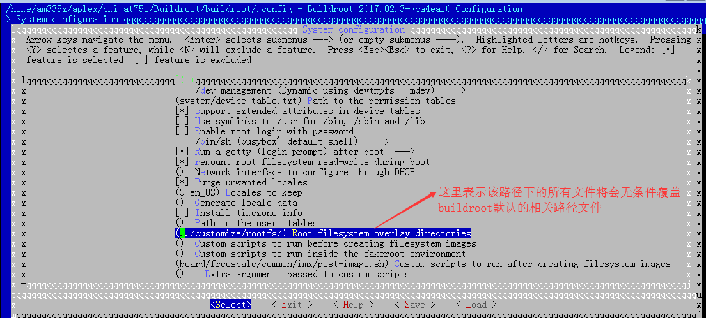

* 2.3.1 编译自己的内核
[参考链接](https://blog.csdn.net/xj178926426/article/details/53118589)

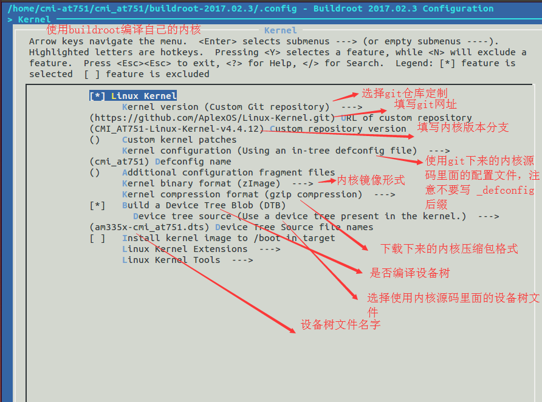

```sh
注意上图有错误：
(am335x-cmi_at751) Device Tree Source file names （不要带后缀名 .dts）
```
```#!/bin/sh
  配置内核
    等用buildroot下载内核源码之后，我们可以使用如下命令来配置内核：
  make linux-menuconfig
```

* 2.3.2 编译自己的驱动模块
[参考链接](https://buildroot.org/downloads/manual/manual.html#_infrastructure_for_packages_building_kernel_modules)

```#!/bin/sh
01: ################################################################################
02: #
03: # foo
04: #
05: ################################################################################
06:
07: FOO_VERSION = 1.2.3
08: FOO_SOURCE = foo-$(FOO_VERSION).tar.xz
09: FOO_SITE = http://www.foosoftware.org/download
10: FOO_LICENSE = GPL-2.0
11: FOO_LICENSE_FILES = COPYING
12:
13: $(eval $(kernel-module)) #对比普通的软件包来说，内核驱动软件包多了此步
14: $(eval $(generic-package))

#对比普通的软件包来说，内核驱动软件包多了一步：$(eval $(kernel-module))
```

* 2.4编译3Dqt [参考文档](http://vanguardiasur.com.ar/opengl-es-on-beaglebone-black/)

```sh
  补丁文件：http://patchwork.ozlabs.org/patch/939704/ ，此补丁文件仅做参考使用，不具有实际价值。
  使用buildroot编译QT需要三步
  1. 选择内核
  2.选择sgx驱动与egl库
    ti-sgx-km（BR2_PACKAGE_TI_SGX_KM） ：sgx硬件驱动
    ti-sgx-um（BR2_PACKAGE_TI_SGX_UM） ：提供egl等3D渲染需要的库
  3. 选择QT

  注意：不要选择ti-gfx：ti-gfx是老版本内核所用的提供sgx驱动与egl库，新版本不能用
```

* 2.4.1 修改ti-sgx-km.mk

  ```#!/bin/sh
    buildroot中默认的ti-sgx-km版本是sdk2.0版本，我们需要根据自己的SDK版本进行修改
    1. 下载ti-sgx-km源码
      git clone git://git.ti.com/graphics/omap5-sgx-ddk-linux.git
    2. 切换到合适的版本
      git branch -a
      git checkout ti-img-sgx/1.14.3699939/k4.4
      git log 将当前最新的commit编号拷贝到ti-sgx-km.mk文件中替换掉原先的commit编号。
      make ti-sgx-km 进行编译
  ```
  * 2.4.2 修改ti-sgx-um.mk
```#!/bin/sh
  git clone
  仿照2.4.1 去修改ti-sgx-um.mk
```

* 2.5 编译自己的uboot
  * pass
* 2.6 添加githup软件包
  * [第一种方式](https://buildroot.org/downloads/manual/manual.html)

  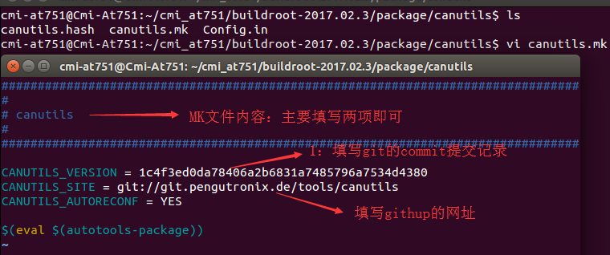

  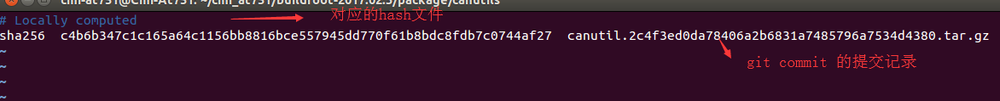

  * 第二种方式

  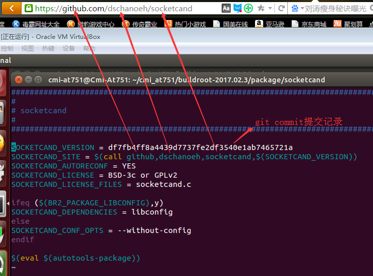
