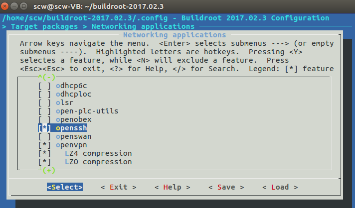
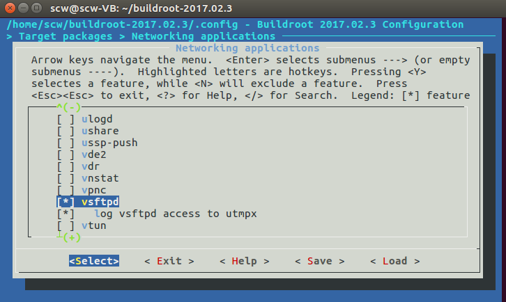
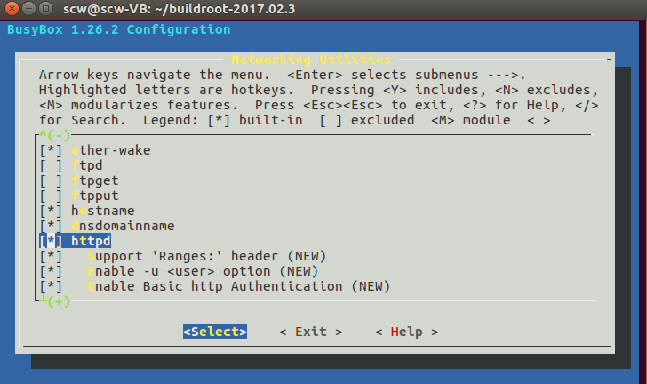
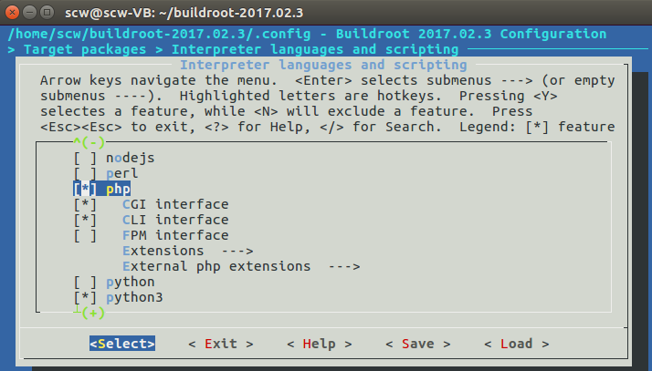
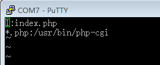
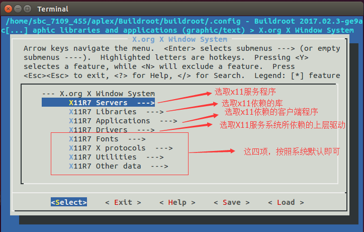
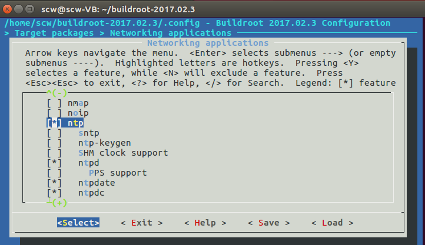
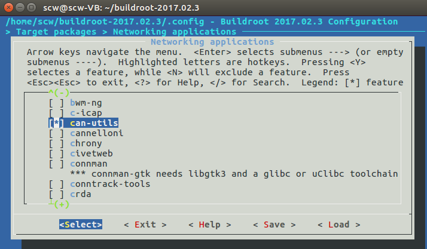
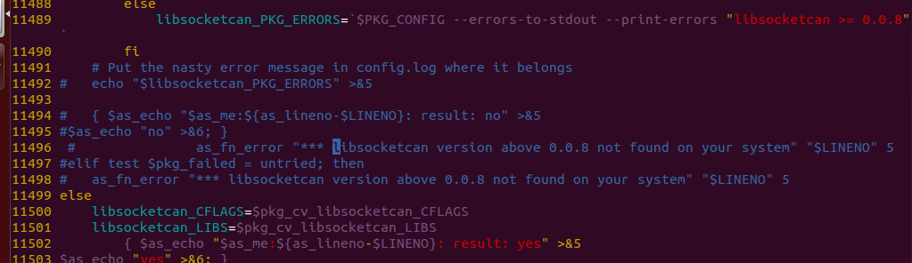
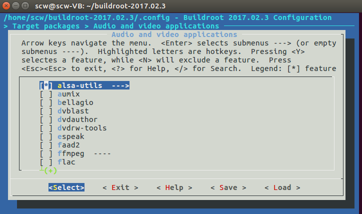

# 系统工具的配置
## 00 目录
* [01 opensshd服务的配置](#jump1)
* [02 vsftpd服务的配置与使用](#jump2)
* [03 httpd服务的配置与使用](#jump3)
* [04 Telnetd的配置与使用](#jump4)
* [05 x11与fluxbox编译](#jump5)
* [06 ntp的配置](#jump6)
* [07 can-utils](#jump7)
* [08 alsa-utils](#jump8)
* [09 补丁制作](#jump9)
* [10 开发工具收集](#jump10)
* [11 显示用户名信息](#jump11)
# [12 搭建开发环境变量](#jump12)

## <span id="jump1">01 opensshd服务的配置

&nbsp;&nbsp;&nbsp;&nbsp;&nbsp;&nbsp;&nbsp;简单配置opensshd服务，打开/etc/ssh/sshd_config，查找下面条目做如下修改，修改完成后再终端输入重启命令（/etc/init.d/S50sshd restart）或者重启开发板使配置生效。
```sh
  Port 22
  AddressFamily any
  ListenAddress 0.0.0.0
  ListenAddress ::
  PermitRootLogin yes
  PasswordAuthentication yes
```
* 使用ssh登录远程机器
```sh
  ssh -l   ARiio_5100 192.168.4.183
```

## <span id="jump2">02 vsftpd服务的配置与使用


&nbsp;&nbsp;&nbsp;&nbsp;&nbsp;&nbsp;&nbsp;简单配置Vsftpd的配置文件，在/etc/vsftpd.conf查找并修改成如下内容：
```sh
anonymous_enable=YES
local_enable=YES
write_enable=YES
local_umask=022
anon_root=/var/ftp
anon_upload_enable=YES
anon_mkdir_write_enable=YES
listen=YES
```
&nbsp;&nbsp;&nbsp;&nbsp;&nbsp;&nbsp;&nbsp;修改完配置文件后，在终端命令行输入服务重启命令（/etc/init.d/S70vsftpd restart）或重启开发板配置生效。vsftpd的使用如下:
```
客户端输入：ftp IP ；（例如： ftp 192.168.8.100）
输入用户名和密码（Root用户登录名：root，匿名用户登录名：anonymous）
```
## <span id="jump3">03 httpd服务的配置与使用
* make busybox-menuconfig 打开 httpd
* make menuconfig 打开PHP选项



* 3)在/etc 目录下创建http的配置文件 httpd.conf，在httpd.conf文件中添加下面代码。

```sh
  I:index.php ：指定httpd的默认网页文件
  *.php:/usr/bin/php-cgi ：指定PHP文件的解释器
```
* 4. 修改/etc/php.ini
```sh
  cgi.force_redirect = 0
  cgi.redirect_status_env ="yes";
将这两句前面注释号去掉
```
* 5)在 /etc/init.d/ 下面创建httpd的启动脚本S71httpd

```sh
#! /bin/sh

set -e

DESC="httpd"
NAME=httpd
DAEMON=/usr/sbin/$NAME

case "$1" in
start)
      printf "Starting $DESC: "
      start-stop-daemon -S -b -x $NAME -- -h /var/www/SettingsPage-master/src
      echo "OK"
      ;;
stop)
      printf "Stopping $DESC: "
      start-stop-daemon -K -x $NAME
      echo "OK"
      ;;
restart|force-reload)
      echo "Restarting $DESC: "
      $0 stop
      sleep 1
      $0 start
      echo ""
      ;;
*)
      echo "Usage: $0 {start|stop|restart|force-reload}" >&2
      exit 1
      ;;
esac

exit 0
-h  /var/www/SettingsPage-master/src : -h 指定服务器的家目录
```
* 6）设置静态IP
```sh
cat /etc/network/interfaces
auto eth0
iface eth0 inet static
address 192.168.8.100    
netmask 255.255.255.0
gateway 192.168.8.2
dns-nameserver 119.29.29.29
```
* 7）PHP测试
```sh
cat  /var/www/SettingsPage-master/src/index.php
<?php
phpinfo();
?>
```

## <span id="jump4">04 Telnetd的配置与使用
```sh
修改配置文件，创建设备节点，修改内容如下：
  1．在/etc/init.d/rcS 文件末尾添加内容：
    /bin/mkdir /dev/pts
    /bin/mount -t devpts devpts /dev/pts
  2．在/etc/inittab 文件末尾添加内容：
    ::once:/sbin/telnetd -l /bin/login
  3．在/etc/fstab 文件末尾添加内容：
    devpts /dev/pts devpts defaults 0 0
创建登陆账号和密码，用于telnet登陆。
  1.在/etc/passwd 文件末尾添加如下内容:
    root:xxx:0:0:root:/:bin/sh
  2.在/etc/group文件末尾添加如下内容：
    root:xxx:0:root
```
&nbsp;&nbsp;&nbsp;&nbsp;&nbsp;&nbsp;&nbsp;在设置完上述内容后，重启开发板，使配置生效，在串口终端输入命令 telnetd（/usr/sbin/telnetd）启动服务，然后在客户端使用 telnet ip （例如：telnet 192.168.4.250）登录服务器,在登录窗口中输入 root + 密码。
## <span id="jump5">05 x11与fluxbox编译

* 1. 详细功能选项（本文中没有明文列出的，表示可以选择默认选项）

```sh
Toolchain —>
·[X] Enable WCHAR support
·[X] Enable C++ support
X.org X Window System
  X11R7 Servers  --->
    [*] xorg-server
      X Window System server version (1.19.1)  --->
      X Window System server type (Modular X.org)  --->
  X11R7 Libraries  --->
    [*]   xcb-util-cursor
  X11R7 Applications  --->
    [*] setxkbmap
    [*] twm
    -*- xauth
    [*] xclock
    [*] xinit
    [*] xinput
    -*- xkbcomp
    -*- xmodmap
  X11R7 Drivers  --->
    [*] xf86-input-evdev  （当选择udev时可以选择此项）
    [*] xf86-input-keyboard
    [*] xf86-input-mouse
    [*] xf86-video-cirrus
    [*] xf86-video-fbdev
    [*] xf86-video-vesa

其他的杂项选择
[*] xterm
[*] fluxbox
```
* 2. Buildroot安装eudev(udev)的情况根据需要将mdev替换成udev编译
* 3. fluxbox开机自启动

```sh
  fluxbox开机自启动(有两种方法)
  方法一 ：
  1. 参考文章：http://www.eefocus.com/toradex/blog/18-01/426601_a6317.html
    创建启动脚本:
    cat /etc/init.d/S72fluxbox添加如下内容：
    Xorg &
    export DISPLAY=:0
    Xterm & //如果想让xterm开机启动，则可以在Xorg &运行之后添加自启动程序，例如xterm
    startfluxbox &  开机自启动一个程序
---------------------------------------------------
    Xorg &
    export DISPLAY=:0
    startfluxbox &
    xterm &
    qt5_led4 -platform xcb &  开机自启动两个程序
  在/etc/profile文件中添加如下内容
    export DISPLAY=:0

  方法二 ：
  创建启动脚本
    cat /etc/init.d/S72fluxbox添加如下内容：
    xtartx   &
    注意 在 .xinitrc文件中添加如下内容
    qt5_led4 -platform xcb &  //X的一个客户端程序，作用是用来拉起x服务器
    exec startfluxbox         //先运行x服务器，才能运行startfluxbox
```

* [Fluxbox参考链接](http://wiki.ubuntu.org.cn/index.php?title=UbuntuHelp:Fluxbox/zh&variant=zh-tw+%E9%A6%96%E5%85%88%E6%98%AF%E4%B8%80%E4%BA%9B%E6%9C%89%E7%94%A8%E7%9A%84Dock%3A)

* Fluxbox启动配置

```sh
1. 在使用Fluxbox之前，我们要先进行一些配置修改:
sudo vi /usr/share/xsessions/fluxbox.desktop
	将 exec=fluxbox 改为exec=startfluxbox
Vi ~/.fluxbox/startup
	添加 export  LC_ALL=C

2. 如何启动fluxbox
echo “exec startfluxbox” > ~/.xinitrc
startx

3. fluxbox是一个右键菜单功能强大的桌面系统，桌面没有直接图标可供点击。安装好fluxbox后，在你的/home/***（*代表你的用户名）那里就有了一个.fluxbox文件夹，里面有menu,keys,init,startup这四个文件，通过配置这四个文件来配置你的桌面系统。

Menu 文件：配置菜单选项
Keys 文件：配置快捷键选项
Init 文件：配置会画设置
Startup 文件：fluxbox启动相关设置（例如启动速度的设置）

4. 使用Fluxbox
  1：桌面上点击鼠标右键，并选择你想运行的程序
  2：转动鼠标中键就可以实现在各个桌面之间的切换
  3：用鼠标的中键点住某一个窗体的标题栏，然后拖到另一个窗体的标题栏上并放开鼠标中键，这两个窗体就组合在一起了。这时你只要通过左键在组合窗体的标题栏上点击就可以实现里面组合子窗体的切换了。

```
* Fluxbox 系统配置

```sh
1：配置菜单（第一行（begin）和最后一行(end),这两行标志着一个菜单项的开始和结束。你所有的菜单都是往这两行之间插进去的）
  [begin] (fluxbox)
  [include] (/etc/X11/fluxbox/fluxbox-menu)
  [end]

  include那一行是对已配置好菜单文件的引用，该文件由系统菜单管理程序自动创建。

  菜单项和指向对应程序的基本语法结构是这样的：
  [exec] (Name you want to show up in the menu)   {command}   <path to icon>
   [exec]     (菜单名)                         ｛命令｝   <图标的路径>

参数解释：
  [exec]:申明这是一个可执行的程序
  Name you want to show up in the menu ：菜单名
  {command} <path to icon>：通过终端启动该程序的命令，尽量写出该命令完整的路径
  <path to icon>：<图标的路径>，该项是可选项
  注意：这四项必须在同一行上

建立子菜单：
  	[submenu]  (Name of submenu) {}
    stuff like execs and other submenus
    [end]
    －－－－－－－－－－－－－－－－－－－－－－
    [submenu]  (子菜单名) {}
    [exec] (菜单名) ｛命令｝ <图标>
    [exec] (菜单名) ｛命令｝ <图标>
    ......
    [end]

如何自动生成菜单：
	1：首先，解压需要的文件，并将它复制到/usr/bin

    cd /usr/share/doc/fluxbox
    gzip -d fluxbox-generate_menu.gz
    cp fluxbox-generate_menu /usr/bin

  2：修改文件属性，让它变成可执行文件
  	chmod a+x /usr/bin/fluxbox-generate_menu
  3：用一个本地用户自动生成菜单
  	cd /home/username
  fluxbox-generate_menu
  	4：修改init文件如下：
  		Nano（vi） -w /home/username/.fluxbox/init
  		session.menuFile:       /home/username/.fluxbox/menu

  快捷键设置（~/.fluxbox/keys）
  	语法如下
  	<key combo> :ACTION
  <组合键>:   命令
注意：
	1：键名
		Alt对应的名称是Mod1
		CTRL对应的是Control
		win键对应的是Mod4
		组合键的定义：列如：Alt+F1定义为Mod1 F1
	常用组合件设置：
    Mod1 Tab :NextWindow
    Mod1 Shift Tab :PrevWindow
    Mod1 F1 :Workspace 1
    Mod1 F2 :ExecCommand fbrun ;not the default for fluxbox, but this behaves like KDE/Gnome
    Mod1 F3 :Workspace 3
    Mod1 F4 :Workspace 4
    Mod1 F5 :Workspace 5
    Mod1 F6 :Workspace 6
    Mod1 F7 :Workspace 7
    Mod1 F8 :Workspace 8
    Mod1 F9 :Workspace 9
    Mod1 F10 :Workspace 10
    Mod1 F11 :Workspace 11
    Mod1 F12 :Workspace 12
    Mod4 F1 :ExecCommand /usr/bin/evolution
    Mod4 F5 :ExecCommand x-terminal-emulator -T "Bash" -e /bin/bash --login
    Mod4 F2 :ExecCommand /usr/bin/epiphany
    Mod4 F3 :ExecCommand /usr/bin/xine
    Mod4 F4 :ExecCommand /usr/bin/best --no-tray
    配置init文件：
设置桌面背景格式如下：
		Fbsetbg  -f  /path/to/image_file
		"fbsetbg -l"会将你的桌面背景设回你上次使用的背景

	可以将这段代码添加到~/.fluxbox/init 文件中这个位置:
 session.screen0.rootCommand: fbsetbg –l

~/.fluxbox/startup File


注意这里我们没有使用符号&：/usr/bin/fluxbox


Ubuntu安装几个桌面系统

Ubuntu下安装卸载桌面系统
安装GNOME方法：
    sudo apt-get install gnome（安装后，进入gnome桌面：startx）
    或者
    sudo apt-get install gnome-desktop

删除Gnome的方法：
    apt-get –purge remove liborbit2

安装kde方法:
    sudo apt-get install kde（实验可以）
    安装KDE:
方法一：

sudo apt-get install kubuntu-desktop
        sudo apt-get install language-pack-kde-zh language-pack-kde-zh-base language-pack-zh language-pack-zh-base language-support-zh

方法二：
        sudo apt-get install kde kde-i18n-zhcn
        sudo apt-get install language-pack-kde-zh language-pack-kde-zh-base language-pack-zh language-pack-zh-base language-support-zh

删除KDE的方法：
    for 5.04:
        apt-get –purge remove kdelibs4 libarts1
    for 5.10:
        apt-get –purge remove kdelibs4c2 libarts1c2
for 6.06:
        apt-get –purge remove kdelibs4c2a libarts1c2a

安装Xfce方法：
sudo apt-get install xubuntu-desktop

卸载Xfce的方法:
    sudo apt-get remove xubuntu-desktop

安装Fluxbox方法：
    sudo apt-get install fluxbox
	echo “exec startfluxbox” > ~/.xinitrc

卸载Fluxbox方法:
    sudo apt-get remove fluxbox：

查询依赖关系：apt-cache depends
```

## <span id="jump6">06 ntp的配置

* 配置ntp
```sh
ntp的配置文件是 /etc/ntp.conf。
a)ntp服务端配置（vi  /etc/ntp.conf）
  指定上层服务器（给我的服务器提供ntp服务的机器），格式如下
    server 1.cn.pool.ntp.org
    server 0.asia.pool.ntp.org
  指定ntp自调整时间误差的文件
    driftfile  /var/lib/ntp/drift （文件是系统自动创建，但必须是全路径，内容也由系统填写）
  预设的一个内部时钟资料
    server    127.127.1.0     # 本地时钟
    fudge     127.127.1.0  stratum 10 （本地时钟用在没有外部NTP服务器时，如果有外部ntp服务器，我们可以将它注解掉，stratum 10 表示将本机服务器设置为等级10,1级最大，16级最小。）
  设置客户端权限
      格式如下：
      restrict    [你的IP]    mask    [netmask_IP]     [parameter]
    只有被restrict 修饰的IP才具有访问本服务器的资格,举例说明：
    restrict 192.168.1.0 mask 255.255.255.0 nomodify notrap ，允许局域网内所有client连接到这台服务器同步时间.但是拒绝让他们修改服务器上的时间（从掩码可以得知这一网络号的所有主机（256-2）台。）
  b)ntp客户端设置（vi  /etc/ntp.conf）
    将服务器的IP添加到客户端的/etc/ntp.conf文件里，并注释该文件中掉无用的服务器IP。
    #server 1.cn.pool.ntp.org
    #server 0.asia.pool.ntp.org
    server 192.168.3.251 （服务器IP）
  c)更新系统和硬件时钟
    将本机与ntp服务器同步：  ntpdate 192.168.3.251（服务器IP地址）
    把系统时间写入硬件： hwclock –w
  d)设置系统时区（/usr/share/zoneinfo/）
    rm  /etc/localtime
    ln  -s   /usr/share/zoneinfo/posix/Asia/Shanghai  /etc/localtime
```
## <span id="jump7">07 can-utils

* 命令简介

```sh
命令 + --help]的方式来查看命令的详细用法，下面只介绍一些常用的指令。
ifconfig  -a  查看can口
ip命令在iproute2工具包中。
配置CAN的总线通讯波特率：canconfig canX bitrate + 波特率
  例如：canconfig  can0  bitrate  500000

开启 / 重启 / 关闭CAN总线：canX  start/stop/restart
  例如：can0  start

查看CAN总线状态：canecho canX
  例如：canecho can0

发送信息：cansend canX –-identifier=ID + 数据
  例如：cansend  can0  --identifier=0x123 + 0x12

接收数据：candump canX
  例如：candump  can0

使用滤波器接收ID匹配的数据：candump canX –-filter=ID:mask
  例如：candump can0  --filter=0x123:0x7ff

ifconfig can0 down              //关闭can0，以便配置
ip link set can0 up type can bitrate 250000   //设置can0波特率
ip -details link show can0            //显示can0信息
```
* 手动编译can-utils
```sh
  1：编译libsocketcan
    从buildroot里面拷贝一份libsocketcan的源代码压缩包，解压后进入到libsocketcan的根目录下，写如下配置文件:
    cat my_config.sh
    ./configure  \
       --host=arm-linux-gnueabihf  \
       --prefix=安装目录
    make  && make install

  2：编译can-utils
    下载源文件https://public.pengutronix.de/software/socket-can/canutils/v4.0/canutils-4.0.6.tar.bz2
    2.1 解压源代码，写如下配置文件：
    cat my_config.sh
    ./configure \
      --host=arm-linux-gnueabihf \
   	  --prefix=/home/sbc_7109_455/aplex/qt_arm/can_untils/canutils/can_ins   tall  \
      libsocketcan_LIBS=-lsocketcan \
      LDFLAGS=-L/home/sbc_7109_455/aplex/qt_arm/can_untils/libsocketcan/li    bsocketcan-0.0.10/lib_install/lib \
      CPPFLAGS=-I/home/sbc_7109_455/aplex/qt_arm/can_untils/libsocketcan/l    ibsocketcan-0.0.10/lib_install/include

    2.2 修改配置文件configure
    根据 “libsocketcan version above 0.0.8 not found on your system”的错误提示，来修改 configure文件 ，将与该句相关的语句注释掉：
```

参考文件：http://blog.csdn.net/linglongqiongge/article/details/51339743
编译完成之后将 canconfig 等工具拷贝到开发板上。

## <span id="jump8">08 alsa-utils

```sh
命令使用：
  speaker-test  测试alsa是否已经正常工作。
  alsamixer 命令对声卡进行相应的配置。
  alsactl store命令保存当前的声卡配置，在/var/lib/alsa/asound.state文件中有相应的alsamixer配置信息。
  Aplay命令播放wav音频文件。
```
## <span id="jump9">09 补丁制作
```sh
diff -uNr test0 test1 > test1.patch
-r 是一个递归选项，设置了这个选项，diff会将两个不同版本源代码目录
-N 选项确保补丁文件将正确地处理已经创建或删除文件的情况
-u 选项以统一格式创建补丁文件，这种格式比缺省格式更紧凑些
test0 原版本
test1 修改之后的版本
test1.patch 补丁文件
补丁头是分别由---/+++开头的两行，用来表示要打补丁的文件。---开头表示旧文件，+++开头表示新文件。
打补丁：patch -p0 < test1.patch
去除补丁，恢复旧版本：patch -RE -p0 < test1.patch
```
## <span id="jump10">10 开发工具收集
```sh
百度网盘：
Source Insight：https://pan.baidu.com/s/1oseEOWU5RzEVUnrWV532dg 1llq
串口测试软件：https://pan.baidu.com/s/1vrEO4wEEkNGmGk6jh9O4uQ ip64
Xshell：https://pan.baidu.com/s/1zaX2iSRhkrCtBgZWbt8ndw pr6d

远程登录FileZilla：https://pan.baidu.com/s/133TLkyOLHo9ZyJOiWh3LHw n7z3
UE中文版编辑器：https://pan.baidu.com/s/1OiE59Ha_RTfWUHKf4pqmfw tvp7
寄存器位查看小工具：https://pan.baidu.com/s/1zpFxDRL7sNQskY1L9c1rnw 8nhx
```
## <span id="jump11">11 显示用户名信息
```sh
  在 /etc/profile文件末尾添加如下内容
  export PS1='\u@\h:\w # '
```
## <span id="jump12">12 搭建开发环境变量
```sh
在 ~/.bashrc文件末尾添加如下内容：
export PATH+=:/home/cmi-at751/cmi_at751/gcc_arm/gcc-linaro-5.3-2016.02-x86_64_arm-linux-gnueabihf/bin
export CROSS_COMPILE=arm-linux-gnueabihf-
export ARCH=arm

```
