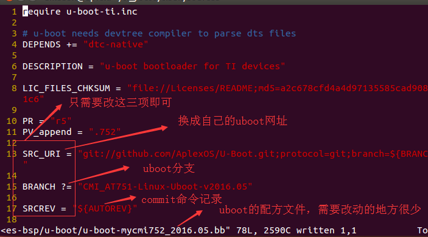

# TI-YOCTO简单搭建使用

## 00 yocto 小知识
* 01 TI yocto软件源码位置
<div>内核源码：/home/am335x/ti_yocto/tisdk/build/arago-tmp-external-linaro-toolchain/work-shared/mycmi751/kernel-source
<br/>
uboot源码：/home/am335x/ti_yocto/tisdk/build/arago-tmp-external-linaro-toolchain/work/mycmi751-linux-gnueabi/u-boot-ti-staging/2016.05+gitAUTOINC+b4e185a8c3-r5.tisdk0/git
<br/>镜像位置：/home/am335x/ti_yocto/tisdk/build/arago-tmp-external-linaro-toolchain/deploy/images
</div>

* yocto配置文件结构

```sh
从新编译某软件
$ bitbake -c clean 软件名
$ bitbake 软件名

yocto配置文件结构：
build/conf   ： 构建级的配置文件目录
bblayers.conf  ：选择要构建的层
local.conf ：配置此次构建的参数

meta-<bsp_name>/conf ：层级别的配置
layer.conf  ： 选择要构建的配方
machine     ：构建的机器的参数（比如镜像启动参数）

recipes-<类型> （比如：recipes-kernel）：某一类功能的配置目录
 <软件名>（比如：lrzsz）               ： 具体某一个软件的配置目录
****.bb  （比如：lrzsz.bb）  ： lrzsz软件的构建配置文件
****.bbappend (比如:lrzsz.bbappend )  ：lrzsz软件在别处定义，此处只是引用配置（具有覆盖的功能）


yocto常用工具使用：
获取命令脚本的帮助信息，在命令后面输入help即可
yocto的命令脚本：poky/scripts，要使用命令脚本，必须搭建构建环境
构建环境的命令：source oe-init-build-env [build_dir]
yocto-bsp：
yocto-bsp  help
yocto-bsp help create
yocto-kernel :
yocto-kernel help
yocto-layer:
yocto-layer help
bikbake:
biebake  help
```
## 01 参考链接
* [环境搭建参考1](http://processors.wiki.ti.com/index.php/Processor_SDK_Building_The_SDK)
* [环境搭建参考2](http://arago-project.org/wiki/index.php/Setting_Up_Build_Environment)
* [SDK版本查看及下载](http://processors.wiki.ti.com/index.php/Processor_SDK_Building_The_SDK)
* [imx6大牛1讲解yocto](https://blog.csdn.net/sy373466062/article/list/4?t=1)
* [imx6大牛2讲解yocto](https://www.kancloud.cn/digest/yocto/138629)


## 02 搭建yocto的PC机（主机）环境
```sh
  sudo apt-get install git build-essential python diffstat texinfo gawk chrpath dos2unix wget unzip socat doxygen libc6:i386 libncurses5:i386 libstdc++6:i386 libz1:i386

  如果主机是64位的，交叉编译工具链是32位的安装下面这些库
  sudo apt-get install ia32-libs
  sudo apt-get install libstdc++6:i386 libncurses5:i386 libz1:i386 libc6:i386 libc6-dev-i386 g++-multilib
  sudo dpkg --add-architecture i386
  sudo apt-get update
```
```sh
  切换主机系统的shell解释器，选择bash,ubuntu默认使用dash。
  sudo dpkg-reconfigure dash   选择"no"  
```

## 03 安装交叉编译工具链
```sh
  wget https://releases.linaro.org/components/toolchain/binaries/7.2-2017.11/arm-linux-gnueabihf/gcc-linaro-7.2.1-2017.11-x86_64_arm-linux-gnueabihf.tar.xz
  tar -Jxvf gcc-linaro-7.2.1-2017.11-x86_64_arm-linux-gnueabihf.tar.xz -C $HOME

```

## 04 安装ti-yocto
```sh
  git clone git://arago-project.org/git/projects/oe-layersetup.git tisdk
  cd tisdk
  ./oe-layertool-setup.sh -f configs/arago-rocko-config.txt  //此处选择合适版本的配置文件
  cd build
  . conf/setenv
  TOOLCHAIN_PATH=$HOME/gcc-linaro-7.2.1-2017.11-x86_64_arm-linux-gnueabihf //为yocto指定交叉编译工具链
  MACHINE=am335x-evm bitbake tisdk-rootfs-image //指定板级文件，编译相关文件系统
```


## 05 根据TI的官方文档进行层的创建
* [参考链接](http://note.youdao.com/noteshare?id=d7b48b870ac3ed1d36293e0396eead88&sub=6540D4B5CD3F4ADB987E617626578790)

## 06 将第二步创建的层（meta-custom）改造成自己的机器


```sh
    cat mycmi751.conf
```


```sh
对于mycmi751.conf文件，在编程过程中发现，会有诸多的麻烦，考虑到要使用TI封装好的软件包组进行编译，所以我们应该采用下面的方式构建板级文件：使我们的板级文件继承TI的板级头文件即可：我们可以从ti 的官方文件中找一个相似的进行操作：
cp meta-ti/conf/machine/am335x-evm.conf   meta-custom/conf/machine
cd meta-custom/conf/machine
mv am335x-evm.conf mycmi752.conf
然后对mycmi752.conf文件进行修改
```

```sh
    cat linux-751.bb
```


## 07 关于板级文件的创建
```sh
    创建板级文件可以采取yocto官方的创建BSP层的方式来进行创建，等BSP层创建完毕后，我们只需要将此BSP层的关于板级文件于内核配方拷贝到meta-custom层相应的位置处即可，然后做适当的修改。

    yocto官方的创建BSP层（选择适当的yocto版本：比如2.3.4，才有这些脚本）：http://note.youdao.com/noteshare?id=c145f5865a56e595bb774fa9a1ca9cbb&sub=95048BAA63D440488F0469906D9478E9
```

## 08 关于根文件系统的构建
```sh
    由于采用ti版本的yocto进行制作，所以我们的根文件系统将仿照TI的进行制作。
```

<br>
<div>
需要注意的一点如下图：
将自己的板级名字添加到ti的文件系统库中：
</div>


## 09 给自己的BSP添加自己的uboot
```sh
  参考 ti 的 meta-ti/recipes-bsp/u-boot目录和 meta-ti/conf/machine/include/omap3.inc文件进行自己的配置。
```
<div>
cat  meta-custom/conf/machine/mycmi752.conf
</div>


<div>
cat  meta-custom/recipes-bsp/u-boot/u-boot-mycmi752_2016.05.bb
</div>

