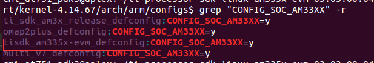

# kernel的配置

```sh
  1. 在 kernel-4.14.67/arch/arm/configs目录中搜索 grep "CONFIG_SOC_AM33XX" -r
```



```sh
1.1 本文以 make tisdk_am335x-evm_defconfig 为模块
直接编译 tisdk_am335x-evm_defconfig 生成的内核zimage 可以在cmi_at751的系统上运行

或者直接将内核版本4.4.12中的cmi_at751.dts 和cmi_at751_defconfig 拷贝到内核版本的4.14.67中相应位置，然后直接编译也可以运行(但会出现不稳定问题)。

建议：直接使用tisdk_am335x-evm_defconfig的内核，然后进行驱动的增删配置
```
