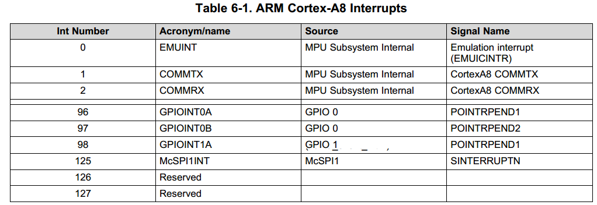
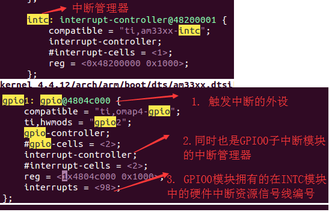
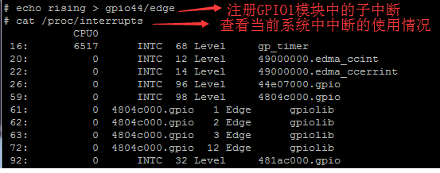

# 中断处理介绍
## 00 am335x中断简介
* TI-am335x MPU支持128个输入中断线(芯片手册第六章)，中断信号线及类型介绍如下图所示。


* 中断的层级（传递）关系

```sh
  MPU------>intc(中断管理器)------->具有中单信号线的外设（比如gpio模块，同时也是gpio子模块的中断管理器）------->子中断信号
```
## 01 中断在设备树中的配置
* 使能中断管理器及子中断管理器（字中断管理器以gpio1模块为例）


```sh
  注意：将GPIO引脚配置成中断的时候，一定记得添加上拉电阻选项，否则此引脚（如果默认是下拉电阻）可能由于闭合回路分压造成引脚的输入电压驱动不够，触发不了中断。

  配置成上拉电路：中断电路是一个开路电路，不会出现分压现象
  配置成下拉电路：中断电路是一个闭合电路，会出现分压现象
```

## 02 中断资源在内核中的编号映射
* echo rising > gpio44/edge  注册GPIO44引脚所对应的GPIO1模块的子中断。
* cat /proc/interrupts 查看系统中现有中断



* 对/proc/interrupts文件内容进行解释

软件系统资源编号 | 当前触发次数 | 中断所处的中断资源管理器|硬件资源编号|触发方式|注册的中断名称
---|---|---|---|---|---
16： | 6517|INTC|68|Level|gp_timer
59: | 0|INTC|98|Level|4804c000.gpio
61: | 0|4804c000.gpio|1  (gpio1_1)|Edge|gpiolib
62: | 0|4804c000.gpio|2  (gpio1_2)|Edge|gpiolib
63: | 0|4804c000.gpio|3  (gpio1_3)|Edge|gpiolib
72: | 0|4804c000.gpio|12 (gpio1_12)|Edge|gpiolib

* 由上表可知，对于GPIO子系统来说，比如我要求GOIP1_12的中断软件资源编号，则：
```
  gpio1_12 = GPIO1 + gpio1_12的引脚位置
           = 59 + （12 +1）
           = 72
```
