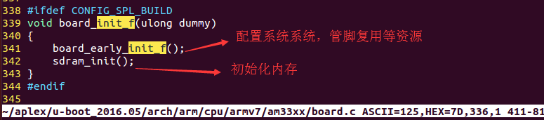

# 系统时钟初始化
<div>时钟设置简图以3星为例</div>


## 01 本文内容简介
* 01 P、M、S的含义
* 02 系统时钟初始化时期
* 03 设置MPU,CORE,DDR等模块的频率
* 04 uboot 设置电压与mpu频率

## 02  P、M、S的含义
<div> P、M、S的含义如下图所示</div>


```sh
  注意：系统时钟初始化就是 FCLK、PCLK、HCLK的设置
```

## 03 系统时钟初始化时期




## 04 频率的设置与修改


```sh
    params = get_dpll_core_params();   # 获取预设的频率参数
    do_setup_dpll(&dpll_core_regs, params);  # 根据预设的频率设置相关模块的频率
```

<div>频率预设结构体参数简介</div>


<div>频率预设结构体</div>


## 05 uboot 设置电压与mpu频率
```sh
系统时钟初始化是设置的起始频率，后面还需要根据相应的电压值进行频率的修正。
Uboot具体设置如下：

修改系统频率：
    先修改电压值，然后在修改系统频率，否则会出错。
```

<div> 获取想要设置的频率</div>


<div> 修改此频率所对应的电压</div>


<div> 设置电压、频率</div>


