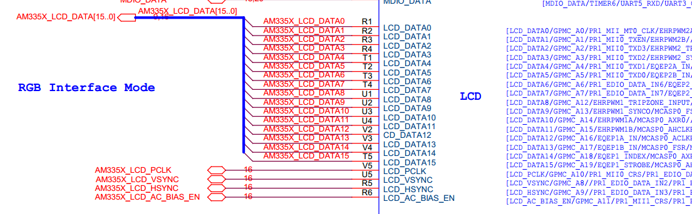
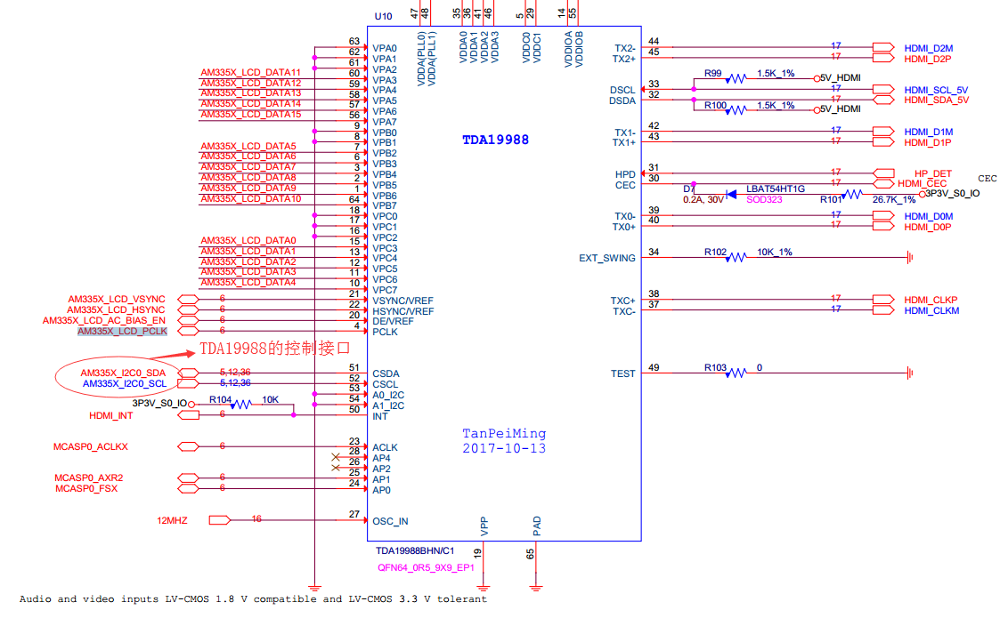
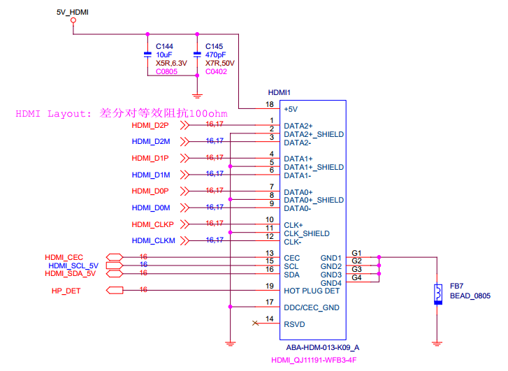

# HDMI 接口模式配置
* 01 原理图







* 02 设备树引脚配置
```sh
lcd_pins_s0: lcd_pins_s0 {
      pinctrl-single,pins = <
         /* 0x1b0 0x03      xdma_event_intr0, OMAP_MUX_MODE3 | AM33XX_PIN_OUTPUT */
          0xe0 ( PIN_OUTPUT | MUX_MODE0 ) /* (U5) lcd_vsync.lcd_vsync */
          0xe4 ( PIN_OUTPUT | MUX_MODE0 ) /* (R5) lcd_hsync.lcd_hsync */
        0xe8 ( PIN_OUTPUT | MUX_MODE0 )  /*(V5) lcd_pclk.lcd_pclk */
          0xec ( PIN_OUTPUT | MUX_MODE0 )  /*(R6) lcd_ac_bias_en.lcd_ac_bias_en */
          0xa0 ( PIN_OUTPUT | MUX_MODE0 )  /*(R1) lcd_data0.lcd_data0 */
          0xa4 ( PIN_OUTPUT | MUX_MODE0 )  /*(R2) lcd_data1.lcd_data1 */
          0xa8 ( PIN_OUTPUT | MUX_MODE0 )  /*(R3) lcd_data2.lcd_data2 */
          0xac ( PIN_OUTPUT | MUX_MODE0 )  /*(R4) lcd_data3.lcd_data3 */
          0xb0 ( PIN_OUTPUT | MUX_MODE0 )  /*(T1) lcd_data4.lcd_data4 */
          0xb4 ( PIN_OUTPUT | MUX_MODE0 )  /*(T2) lcd_data5.lcd_data5 */
          0xb8 ( PIN_OUTPUT | MUX_MODE0 )  /*(T3) lcd_data6.lcd_data6 */
          0xbc ( PIN_OUTPUT | MUX_MODE0 )  /*(T4) lcd_data7.lcd_data7 */
          0xc0 ( PIN_OUTPUT | MUX_MODE0 )  /*(U1) lcd_data8.lcd_data8 */
          0xc4 ( PIN_OUTPUT | MUX_MODE0 )  /*(U2) lcd_data9.lcd_data9 */
          0xc8 ( PIN_OUTPUT | MUX_MODE0 )  /*(U3) lcd_data10.lcd_data10 */
          0xcc ( PIN_OUTPUT | MUX_MODE0 )  /*(U4) lcd_data11.lcd_data11 */
          0xd0 ( PIN_OUTPUT | MUX_MODE0 )  /*(V2) lcd_data12.lcd_data12 */
          0xd4 ( PIN_OUTPUT | MUX_MODE0 )  /*(V3) lcd_data13.lcd_data13 */
          0xd8 ( PIN_OUTPUT | MUX_MODE0 ) /* (V4) lcd_data14.lcd_data14 */
          0xdc ( PIN_OUTPUT | MUX_MODE0 ) /* (T5) lcd_data15.lcd_data15 */
      >;
  };
lcd_pins_sleep: lcd_pins_sleep {
               pinctrl-single,pins = <
                   /* 0x1b0 0x03      xdma_event_intr0, OMAP_MUX_MODE3 | AM33XX_PIN_OUTPUT */
                   0xe0 ( PIN_OUTPUT | MUX_MODE7 ) /* (U5) lcd_vsync.lcd_vsync */
                   0xe4 ( PIN_OUTPUT | MUX_MODE7 ) /* (R5) lcd_hsync.lcd_hsync */
                   0xe8 ( PIN_OUTPUT | MUX_MODE7 )  /*(V5) lcd_pclk.lcd_pclk */
                   0xec ( PIN_OUTPUT | MUX_MODE7 )  /*(R6) lcd_ac_bias_en.lcd_ac_bias_en */
                   0xa0 ( PIN_OUTPUT | MUX_MODE7 )  /*(R1) lcd_data0.lcd_data0 */
                   0xa4 ( PIN_OUTPUT | MUX_MODE7 )  /*(R2) lcd_data1.lcd_data1 */
                   0xa8 ( PIN_OUTPUT | MUX_MODE7 )  /*(R3) lcd_data2.lcd_data2 */
                   0xac ( PIN_OUTPUT | MUX_MODE7 )  /*(R4) lcd_data3.lcd_data3 */
                   0xb0 ( PIN_OUTPUT | MUX_MODE7 )  /*(T1) lcd_data4.lcd_data4 */
                   0xb4 ( PIN_OUTPUT | MUX_MODE7 )  /*(T2) lcd_data5.lcd_data5 */
                   0xb8 ( PIN_OUTPUT | MUX_MODE7 )  /*(T3) lcd_data6.lcd_data6 */
                   0xbc ( PIN_OUTPUT | MUX_MODE7 )  /*(T4) lcd_data7.lcd_data7 */
                   0xc0 ( PIN_OUTPUT | MUX_MODE7 )  /*(U1) lcd_data8.lcd_data8 */
                   0xc4 ( PIN_OUTPUT | MUX_MODE7 )  /*(U2) lcd_data9.lcd_data9 */
                   0xc8 ( PIN_OUTPUT | MUX_MODE7 )  /*(U3) lcd_data10.lcd_data10 */
                   0xcc ( PIN_OUTPUT | MUX_MODE7 )  /*(U4) lcd_data11.lcd_data11 */
                   0xd0 ( PIN_OUTPUT | MUX_MODE7 )  /*(V2) lcd_data12.lcd_data12 */
                   0xd4 ( PIN_OUTPUT | MUX_MODE7 )  /*(V3) lcd_data13.lcd_data13 */
                   0xd8 ( PIN_OUTPUT | MUX_MODE7 ) /* (V4) lcd_data14.lcd_data14 */
                   0xdc ( PIN_OUTPUT | MUX_MODE7 ) /* (T5) lcd_data15.lcd_data15 */
                   >;
           };
nxp_hdmi_cmi_at751_off_pins: nxp_hdmi_bonelt_off_pins {
                      pinctrl-single,pins = <
                                              0x1b0 0x03      /* xdma_event_intr0, OMAP_MUX_MODE3 | AM33XX_PIN_OUTPUT */
                                              >;
  };
```

* 03 设备树相关节点配置

```sh
&i2c0 {
pinctrl-names = "default";
pinctrl-0 = <&i2c0_pins>;

status = "okay";
clock-frequency = <400000>;

tda19988: tda19988 {
    compatible = "nxp,tda998x";
    reg = <0x70>;
    interrupt-parent = <&gpio0>;
    interrupts = <27 2>;
    video-ports = <0x234501>;   配置RGB颜色的配置比，如果颜色反色，就配置此项（蓝色和红色颜色交换），含义：将tda19988配置为16位模式，RGB颜色模式
    pinctrl-names = "default", "off";
    pinctrl-0 = <&lcd_pins_s0>;
    pinctrl-1 = <&nxp_hdmi_cmi_at751_off_pins>;

    ports {
        port@0 {
            hdmi_0: endpoint@0 {
                remote-endpoint = <&lcdc_0>;
            };
        };
    };
};
};
&lcdc {
status = "okay";

blue-and-red-wiring = "crossed";  //配置颜色反色，好像没有效果（本质应该是配置fb_info里面的颜色所占的位宽和起始位：在一个像素中），现在已经把这个去掉了，所以不起作用

port {
    lcdc_0: endpoint@0 {
        remote-endpoint = <&hdmi_0>;
    };
};
};
```
```sh
    配置像素内存的颜色组合例如：
    fb_info->var.red.offset     = 11; 从第11位开始
    fb_info->var.red.length     = 5;

    fb_info->var.green.offset   = 5;从第5位开始
    fb_info->var.green.length   = 6;

    fb_info->var.blue.offset    = 0;从第0位开始
    fb_info->var.blue.length    = 5;
```

* 04 驱动配置
```sh
TILCDC 内核配置：
    fbdev驱动程序不能与DRM驱动程序共存：
      fbdev驱动程序直接将显存数据显示到显示器上，DRM驱动程序先将数据进行渲染，然后再在显示器上显示，所以二者存在矛盾。具体配置如下：
    1 禁用：
    CONFIG_FB_DA8XX
    CONFIG_FB_DA8XX_TDA998X
    2 启用：
    CONFIG_DRM=y/m
    CONFIG_DRM_I2C_NXP_TDA998X=y/m（HDMI（TDA19988芯片驱动）设置）
    CONFIG_DRM_TILCDC=y/m
```
