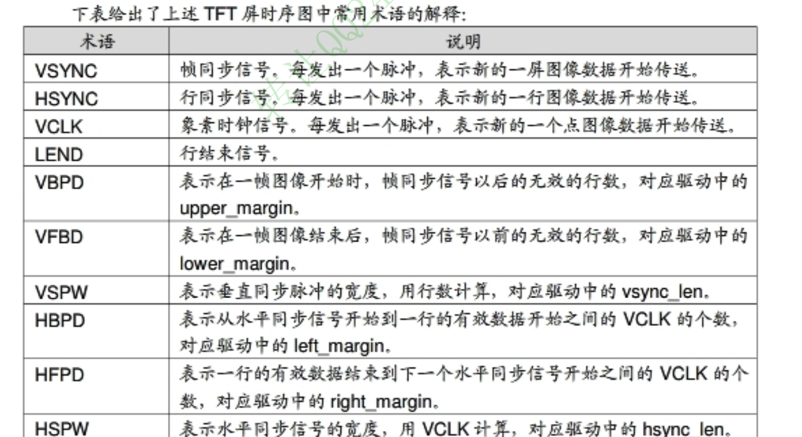
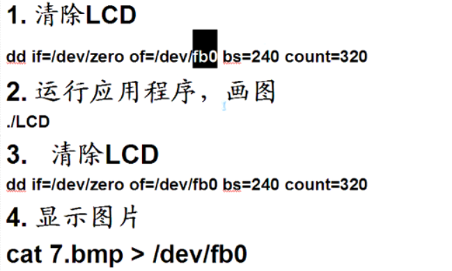
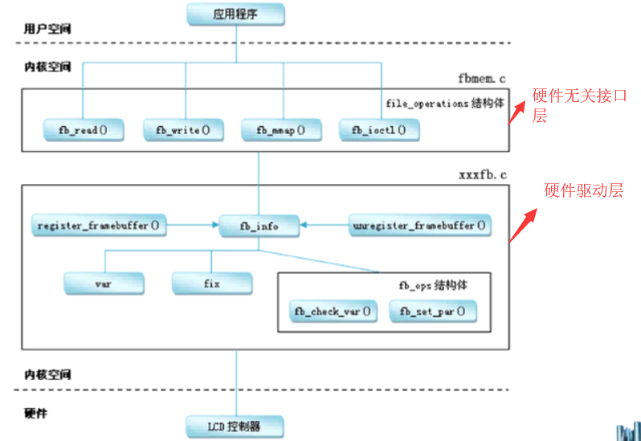
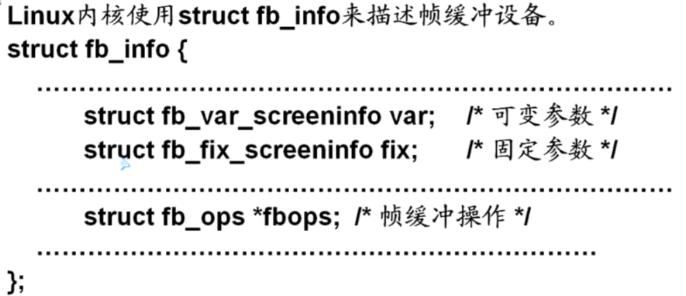
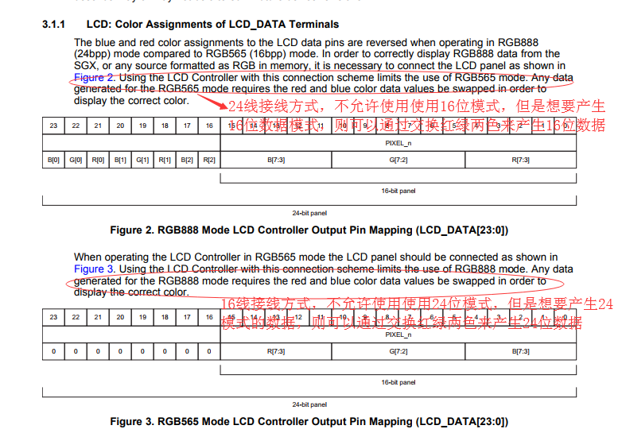
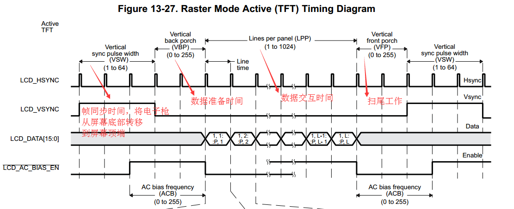
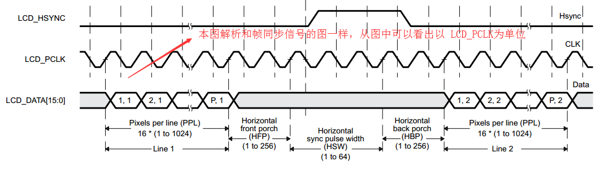

# TI LCDC 简述
* [01 TI lcdc简述](#jump1)
* [02 hdmi](hdmi.md)
* [03 lvds](lvds.md)


## 00 LCD驱动架构介绍（fbdev结构）

* 01 软件调用流程

```sh
    APP ----- > Fbmem.c (硬件无关接口层)--------> tilcdc.c (硬件驱动)------>硬件
```

<div>02 TFT屏常用术语</div>



<div>03 LCD基本操作</div>



<div>04 驱动结构</div>



<div>05 fb_info结构体介绍</div>




* 06 LCD 控制器的配置过程如下

```sh
/* 1. 分配一个fb_info */
s3c_lcd = framebuffer_alloc(0, NULL);

/* 2. 设置 */
/* 2.1 设置固定的参数 */
/* 2.2 设置可变的参数 */
/* 2.3 设置操作函数 */
/* 2.4 其他的设置 */

/* 3. 硬件相关的操作 */
/* 3.1 配置GPIO用于LCD */
/* 3.2 根据LCD手册设置LCD控制器, 比如VCLK的频率等 */
/* 3.3 分配显存(framebuffer), 并把地址告诉LCD控制器 */

/* 4. 注册 */
register_framebuffer(s3c_lcd);
```

* 07 fb_info主要参数介绍

```sh
  主要参数设置，其余的保持默认即可
  /* 1. 分配一个fb_info */
	s3c_lcd = framebuffer_alloc(0, NULL);

	/* 2. 设置 */
	/* 2.1 设置固定的参数 */
	strcpy(s3c_lcd->fix.id, "mylcd");
s3c_lcd->fix.smem_start = xxx; 显存的物理地址
	s3c_lcd->fix.smem_len = 480*272*16/8; 显存的大小（byte）
	s3c_lcd->fix.type     = FB_TYPE_PACKED_PIXELS; 显示器的接口类型（vga,平板等）
	s3c_lcd->fix.visual   = FB_VISUAL_TRUECOLOR; /* TFT */  显示器的材质（黑白色，彩色等）
	s3c_lcd->fix.line_length = 480*2; (一行有多少个字节)

	/* 2.2 设置可变的参数 */
	s3c_lcd->var.xres           = 480; 显示器物理长度
	s3c_lcd->var.yres           = 272;显示器物理宽度
	s3c_lcd->var.xres_virtual   = 480;显示器虚拟长度
	s3c_lcd->var.yres_virtual   = 272;显示器虚拟宽度
	s3c_lcd->var.bits_per_pixel = 16;没像素多少bit
注意：显示器的物理长度、宽度表示显示器的真实尺寸
显示器的虚拟长度、宽度表示显示器的当前显示所采用的尺寸，就是我们在win7上调节屏幕分辨率所用的参数


	/* RGB:565 */ 一共16位
	s3c_lcd->var.red.offset     = 11; 从第11位开始
	s3c_lcd->var.red.length     = 5;

	s3c_lcd->var.green.offset   = 5;从第5位开始
	s3c_lcd->var.green.length   = 6;

	s3c_lcd->var.blue.offset    = 0;从第0位开始
	s3c_lcd->var.blue.length    = 5;

	s3c_lcd->var.activate       = FB_ACTIVATE_NOW;


	/* 2.3 设置操作函数 */
	s3c_lcd->fbops              = &s3c_lcdfb_ops;

	/* 2.4 其他的设置 */
	s3c_lcd->pseudo_palette = pseudo_palette;
	//s3c_lcd->screen_base  = ;  /* 显存的虚拟地址 */
	s3c_lcd->screen_size   = 480*272*16/8;

	/* 3. 硬件相关的操作 */
```

## <span id="jump1">01 TIlcdc简述

[00 驱动与设备树配置参考链接](http://processors.wiki.ti.com/index.php/Sitara_Linux_LCDC_Porting_Guide?keyMatch=pinctrl&tisearch=Search-EN)

[01 DRM驱动框架介绍](http://www.landley.net/kdocs/htmldocs/drm.html)

[02 TI-hdmi驱动配置介绍](http://processors.wiki.ti.com/index.php/Linux_Core_LCD_Controller_User_Guide?keyMatch=EDID&tisearch=Search-EN)

[03 内核framebuffer介绍](https://www.kernel.org/doc/Documentation/fb/framebuffer.txt)

* 00 TI-LCD模式介绍

```sh
LCD控制器可以在两种独立模式下使用
  1  raster controller mode 光栅控制器模式
  2 LCD interface display driver (LIDD) mode
  tilcdc驱动程序仅支持光栅控制器模式
```
```SH
LCDC  memory bandwidth issues （内存带宽问题）
当LCDC使用高像素时钟和高像素彩色格式时容易出现如下问题：
DMA FIFO underflow and frame synchronization lost errors（DMA FIFO下溢和帧同步丢失错误），解决办法是打TI的补丁：https://lists.denx.de/pipermail/u-boot/2016-December/275681.html
```

* 01 输出数据位与颜色问题

```sh
  对于TI的LCD控制器来说，默认情况下LCD控制器输出结果如下：
    01 如果LCD控制器输出的是16位数据，则颜色是BGR模式，
    02 如果LCD控制器输出的是24位数据，则颜色是RGB模式。
```
[下图地址](http://www.ti.com/lit/er/sprz360i/sprz360i.pdf)




* 02 设备树配置数据信息

<div>帧同步信号</div>



<div>行同步信号</div>



 ```sh
 lcd3 {
     compatible = "ti,tilcdc,panel";
     pinctrl-names = "default";
     pinctrl-0 = <&bone_lcd3_cape_lcd_pins>;
     backlight = <&backlight>;
     enable-gpios = <&gpio3 19 0>;

     panel-info {
         ac-bias           = <255>;
         ac-bias-intrpt    = <0>;
         dma-burst-sz      = <16>;
         bpp               = <16>;  //配置是16位还是其他多少位
         fdd               = <0x80>;
         sync-edge         = <0>;
         sync-ctrl         = <1>;
         raster-order      = <0>;
         fifo-th           = <0>;
     };
    display-timings {
     native-mode = <&timing0>;  //当前采用的时序配置方案
     timing0: 1080p24 {
         /* 1920x1080p24 */   
         clock-frequency = <52000000>;  // lck_pclk的值
         hactive = <1920>;                      //一行有多少个像素点
         vactive = <1080>;                       //一帧有多少个行
         hfront-porch = <25>;                 
         hback-porch = <25>;             
         hsync-len = <25>;
         vback-porch = <2>;
         vfront-porch = <2>;
         vsync-len = <2>;                   上述几个含义参考上图
         hsync-active = <1>;               行同步信号的极性
     };
 };
 ```
