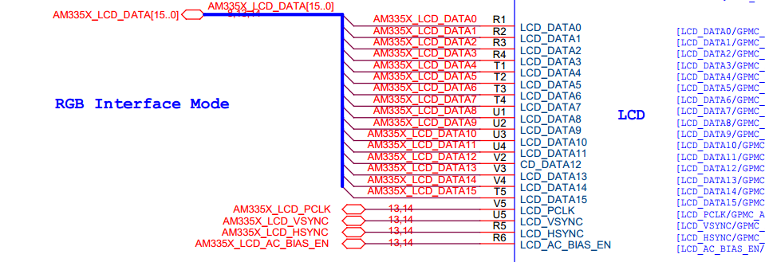
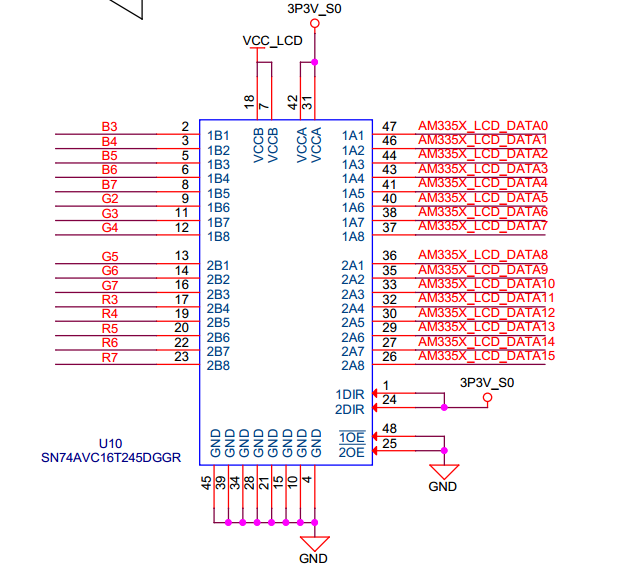
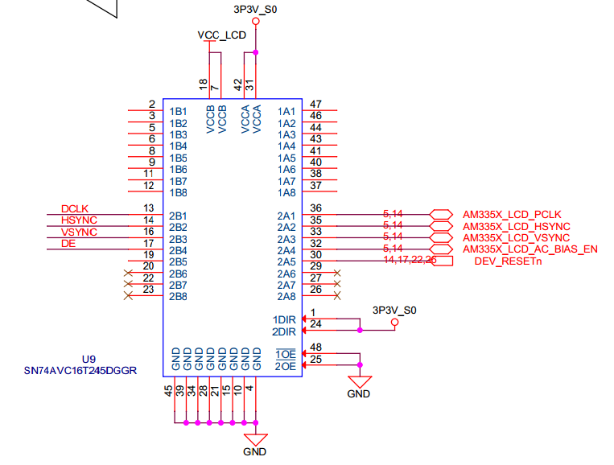
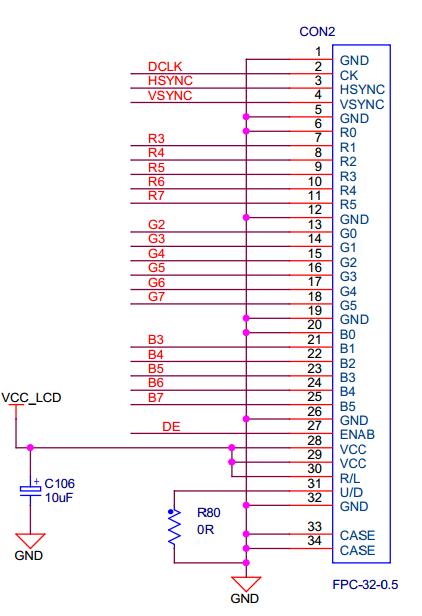
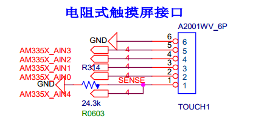
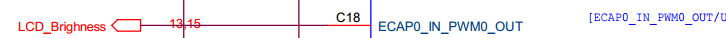

# LVDS接口配置
[参考链接](http://e2e.ti.com/support/processors/f/791/t/340146)

[01 驱动设备树配置](http://processors.wiki.ti.com/index.php/Sitara_Linux_LCDC_Porting_Guide?keyMatch=pinctrl&tisearch=Search-EN)

[02 背光调节](http://processors.wiki.ti.com/index.php/AM335x_PWM_Driver's_Guide?keyMatch=pwm&tisearch=Search-EN)
* 01 原理图











<div>lcd 背光亮度调节引脚</div>



<div>lcd  背光开关引脚</div>


* 02 设备树配置

```sh

1. 复用管脚配置
lcd_pins_s0: lcd_pins_s0 {
      pinctrl-single,pins = <
          0xe0 ( PIN_OUTPUT | MUX_MODE0 ) /* (U5) lcd_vsync.lcd_vsync */
          0xe4 ( PIN_OUTPUT | MUX_MODE0 ) /* (R5) lcd_hsync.lcd_hsync */
          0xe8 ( PIN_OUTPUT | MUX_MODE0 ) /* (V5) lcd_pclk.lcd_pclk */
          0xec ( PIN_OUTPUT | MUX_MODE0 ) /* (R6) lcd_ac_bias_en.lcd_ac_bias_en */
          0xa0 ( PIN_OUTPUT | MUX_MODE0 ) /* (R1) lcd_data0.lcd_data0 */
          0xa4 ( PIN_OUTPUT | MUX_MODE0 ) /* (R2) lcd_data1.lcd_data1 */
          0xa8 ( PIN_OUTPUT | MUX_MODE0 ) /* (R3) lcd_data2.lcd_data2 */
          0xac ( PIN_OUTPUT | MUX_MODE0 ) /* (R4) lcd_data3.lcd_data3 */
          0xb0 ( PIN_OUTPUT | MUX_MODE0 ) /* (T1) lcd_data4.lcd_data4 */
          0xb4 ( PIN_OUTPUT | MUX_MODE0 ) /* (T2) lcd_data5.lcd_data5 */
          0xb8 ( PIN_OUTPUT | MUX_MODE0 ) /* (T3) lcd_data6.lcd_data6 */
          0xbc ( PIN_OUTPUT | MUX_MODE0 ) /* (T4) lcd_data7.lcd_data7 */
          0xc0 ( PIN_OUTPUT | MUX_MODE0 ) /* (U1) lcd_data8.lcd_data8 */
          0xc4 ( PIN_OUTPUT | MUX_MODE0 ) /* (U2) lcd_data9.lcd_data9 */
          0xc8 ( PIN_OUTPUT | MUX_MODE0 ) /* (U3) lcd_data10.lcd_data10 */
          0xcc ( PIN_OUTPUT | MUX_MODE0 ) /* (U4) lcd_data11.lcd_data11 */
          0xd0 ( PIN_OUTPUT | MUX_MODE0 ) /* (V2) lcd_data12.lcd_data12 */
          0xd4 ( PIN_OUTPUT | MUX_MODE0 ) /* (V3) lcd_data13.lcd_data13 */
          0xd8 ( PIN_OUTPUT | MUX_MODE0 ) /* (V4) lcd_data14.lcd_data14 */
          0xdc ( PIN_OUTPUT | MUX_MODE0 ) /* (T5) lcd_data15.lcd_data15 */
          0x1b4 (PIN_OUTPUT_PULLUP | MUX_MODE7 ) /* xdma_event_intr1.gpio0_20   lvds_logic_pwr_en    */
      >;
  };  

  ecap0_pins: backlight_pins {
          pinctrl-single,pins = <
              0x164 0x0   /* eCAP0_in_PWM0_out.eCAP0_in_PWM0_out MODE0 */
              0x178 ( PIN_OUTPUT_PULLUP | MUX_MODE7 ) /* (D18) uart1_ctsn.gpio0[12] LVDS_BLKT_ON s*/
          >;
      };


2. 功能节点配置

  backlight {
         compatible = "pwm-backlight";
         pwms = <&ecap0 0 50000 0>;
         brightness-levels = <0 51 53 56 62 75 101 152 255>;
         default-brightness-level = <8>;
     };

     panel {
         compatible = "ti,tilcdc,panel";
         status = "okay";
         pinctrl-names = "default";
         pinctrl-0 = <&lcd_pins_s0>;
         panel-info {
             ac-bias           = <255>;
             ac-bias-intrpt    = <0>;
             dma-burst-sz      = <16>;
             bpp               = <16>;
             fdd               = <0x80>;
             sync-edge         = <0>;
             sync-ctrl         = <1>;
             raster-order      = <0>;
             fifo-th           = <0>;
             invert-pxl-clk    = <1>;
         };

         display-timings {
             native-mode = <&timing0>;
             timing0: 800x480 {
                 clock-frequency = <33260000>;
                 hactive = <800>;
                 vactive = <480>;
                 hfront-porch = <39>;
                 hback-porch = <39>;
                 hsync-len = <47>;
                 vback-porch = <29>;
                 vfront-porch = <13>;
                 vsync-len = <2>;
                 hsync-active = <1>;
                 vsync-active = <1>;
             };
         };
     };

&tscadc {
    status = "okay";
    tsc {
        ti,wires = <5>;
        ti,x-plate-resistance = <200>;
        ti,coordinate-readouts = <5>;
        ti,wire-config = <0x00 0x11 0x22 0x33>;
        ti,charge-delay = <0x400>;
    };

    adc {
        ti,adc-channels = <6 7>;
    };
};

&epwmss0 {
    status = "okay";

    ecap0: ecap@48300100 {
        status = "okay";
        pinctrl-names = "default";
        pinctrl-0 = <&ecap0_pins>;
    };
};

```
