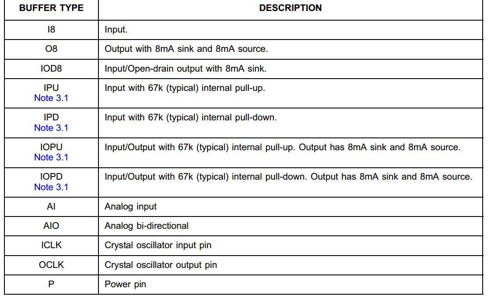
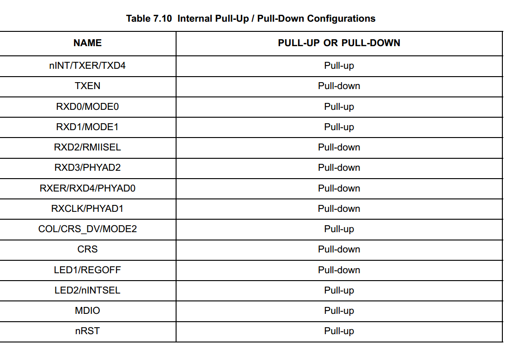
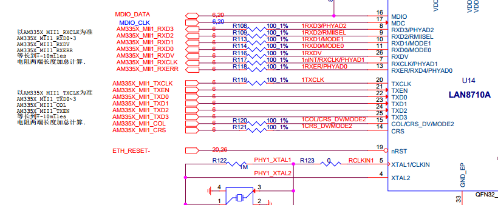
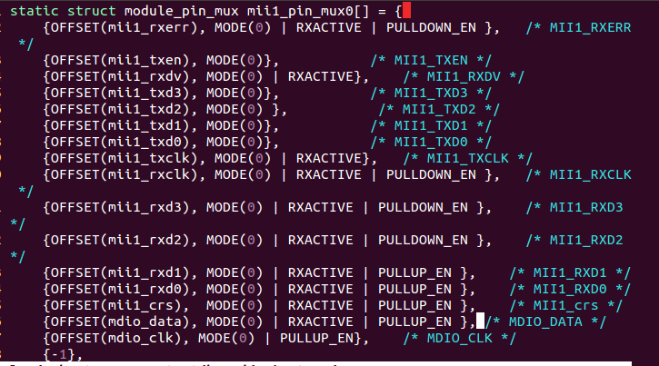
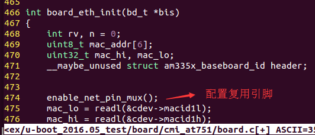
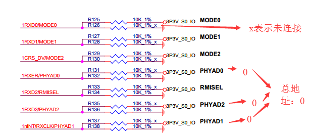
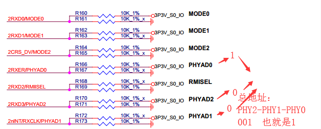
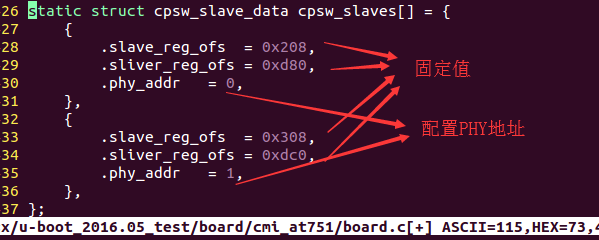
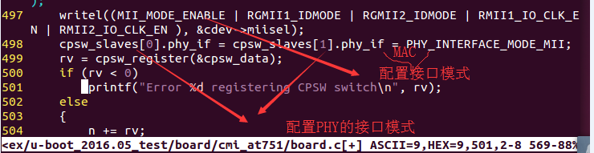
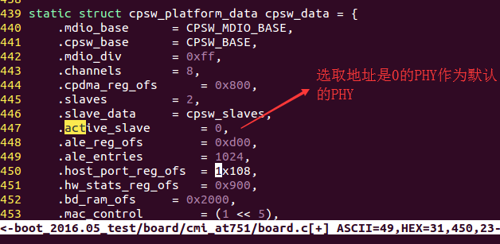

# uboot阶段配置网卡
```sh
  uboot阶段默认只初始化一个网卡，所以我们需要选择一个默认的phy

  网络驱动分类
    ：mac控制器驱动（host端），由SOC（TI）来完成
    ：PHY驱动（设备端），由PHY的生产商提供
```
## 01 配置网络步骤小节
```sh
    0：配置复用管脚
    1：配置PHY的地址：
    2：配置MAC与PHY的接口模式
    3：配置选取默认的phy（对于多网卡而言）
    4：配置特定的PHY的宏定义:初始化特定的PHY
```
## 02 上下拉电阻的作用
```sh
    上拉电阻与下拉电阻是用来确定数字电路中常态的高低电平，若没有这些电阻，端口可能出现界于高低电平之间的电压，这样非常不稳定，所以有些端口即使不用也要接高电平或低电平，以确保工作稳定.

    一、上拉电阻：将一个不确定的信号，通过一个电阻与电源VCC相连，固定在高电平。作用：上拉是对器件注入电流；灌电流；当一个接有上拉电阻的IO端口设置为输入状态时.它的常态为高电平。
    二、下拉电阻：将一个不确定的信号，通过一个电阻与地GND相连，固定在低电平。作用:下拉是从器件输出电流；拉电流。当一个接有下拉电阻的IO端口设置为输入状态时，它的常态为低电平。上拉电阻和下拉电阻2者共同的作用是：避免电压的“悬浮”，造成电路的不稳定。
```
## 03 SOC网络部分引脚的上拉和下拉配置





* mac0：复用管脚配置：








## 04 配置PHY的地址
```sh
  phy的地址由phy的三个引脚的电平信号决定
  三个phy引脚：
    PHYAD0
    PHYAD1
    PHYAD2
  总地址组成：PHYAD2-PHYAD1-PHYAD0
```







## 05 配置SOC上面的MAC与phy的接口


## 06 选择默认的PHY
<div>下面的图片有错误，选取编号是0的PHY作为默认的PHY，这个编号是 cpsw_slaves[]的下标。</div>


## 07 开启此PHY的驱动代码权限
```sh
  开启此PHY的驱动代码权限,在uboot阶段可以运行此phy的驱动代码来配置PHY，使其可以与对应的SOC上面的MAC控制器通信

  在uboot里面，一般是通过PHY的条件编译宏定义来选择编译PHY的驱动
```
