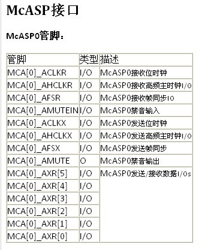

# McAsp使用简介
<p>
  Multichannel Audio Serial Port (McASP):
  <br>
  McASP是美国TI公司的DSP的一种接入接口。称为复通道音频接入接口。这是一种通用的音频接入接口(是CPU与声卡芯片进行音频数据交互的通道接口)。采用的是时分复用的数据流形式。
  <br>
  mcasp是soc与声卡进行数据交互的一种接口模块，声卡是对音频数据处理的芯片（比如控制声音的大小等功能
</p>


```sh
板子配置信息：
  板子：sbc_7109_455
  soc：AM335x
  控制器：mcasp
  声卡（外设）：tlv320aic3106
```

## 01 参考文件
* [MCASP百度百科](https://baike.baidu.com/item/MCASP/1669886?fr=aladdin)
* [PCM简介](https://blog.csdn.net/qingkongyeyue/article/category/7258049)
* [网上am335x声卡配置（设备树版）全套流程](http://www.eeworld.com.cn/mcu/2015/0819/article_21774.html)
* [TI 声卡驱动配置指南](http://software-dl.ti.com/processor-sdk-linux/esd/docs/latest/linux/Foundational_Components_Kernel_Drivers.html#audio)
* [TI 声卡使用参考文档](http://processors.wiki.ti.com/index.php/AM335x_Audio_Driver%27s_Guide)
* [音频子系统框架](https://blog.csdn.net/sanmaoljh/article/category/6387692)

## 02 名词简称
* Multichannel Audio Serial Port (McASP)
* [time-division multiplexed (TDM)](https://baike.baidu.com/item/%E6%97%B6%E5%88%86%E5%A4%9A%E8%B7%AF%E5%A4%8D%E7%94%A8/7831037?fr=aladdin)：划分时间片，不同的时间片传出不同的数据，宏观上看起来就是时间复用的感觉
* Pulse Code Modulation (PCM) ：脉冲编码调制

## 02.1 技术介绍
*  TDM/IIS ：音频数据传输技术
*  DAC    ： 数字量转化为模拟量（播放功能）
* ADC     ：模拟量转换为数字量（录音-数据采集）
* PCM     ： 将数字量进行编码形成脉冲或者将脉冲进行解码形成数字量

## 03 声卡数据处理流程
* [参考地址](http://blog.sina.com.cn/s/blog_7e4797d70102whoa.html)

<div>软件流程</div>


<div>硬件流程</div>


<div>2410流程</div>


## 04 mcasp的管脚功能介绍



## 05 am335x-mcasp声卡数据接口的数据管脚的介绍（AXRn）


## 06 7109声卡硬件原理图


## 07 设备树配置
<div> cat am335x-sbc_7109_455.dts</div>

```sh
mcasp（声卡数据连接器）复用管脚的配置
  mcasp1_pins: mcasp1_pins {
          pinctrl-single,pins = <
              0x1ac ( PIN_INPUT_PULLDOWN | MUX_MODE3 ) /* (A14) mcasp0_ahclkx.mcasp1_axr1 */ //DOUT
              0x1a0 ( PIN_INPUT_PULLDOWN | MUX_MODE3 ) /* (B12) mcasp0_aclkr.mcasp1_aclkx */ //BCLK
              0x1a4 ( PIN_INPUT_PULLDOWN | MUX_MODE3 ) /* (C13) mcasp0_fsr.mcasp1_fsx */ //WCLK
              0x1a8 ( PIN_OUTPUT_PULLDOWN | MUX_MODE3 ) /* (D13) mcasp0_axr1.mcasp1_axr0 */ //DIN
          >;
      };  

  mcasp1_pins_sleep: mcasp1_pins_sleep {
      pinctrl-single,pins = <
          0x1ac (PIN_INPUT_PULLDOWN | MUX_MODE7)
          0x1a0 (PIN_INPUT_PULLDOWN | MUX_MODE7)
          0x1a4 (PIN_INPUT_PULLDOWN | MUX_MODE7)
          0x1a8 (PIN_INPUT_PULLDOWN | MUX_MODE7)
      >;
  };  

  使用相关节点：
  &i2c1 {
  pinctrl-names = "default";
  pinctrl-0 = <&i2c1_pins>;

  status = "okay";
  clock-frequency = <100000>;

  tlv320aic3106: tlv320aic3106@1b { # 配置声卡芯片的I2C接口，配置声卡芯片的相关电源
      #sound-dai-cells = <0>;
      compatible = "ti,tlv320aic3106";
      reg = <0x1b>;
      status = "okay";

      /* Regulators */
      AVDD-supply = <&vaux2_reg>;
      IOVDD-supply = <&vaux2_reg>;
      DRVDD-supply = <&vaux2_reg>;
      DVDD-supply = <&vbat>;
  };
};

#使能mcasp控制器
&mcasp1 {
  #sound-dai-cells = <0>;
  pinctrl-names = "default", "sleep";
  pinctrl-0 = <&mcasp1_pins>;
  pinctrl-1 = <&mcasp1_pins_sleep>;

  status = "okay";

  op-mode = <0>;          /* 选择数据传输协议：比如i2s */
  tdm-slots = <2>;        # 选择有几个声道，2表示有两个声道
  /* 4 serializers */
  //serial-dir = <  /* 0: INACTIVE, 1: TX, 2: RX */
  //  0 1 0 2
  //>;
  serial-dir = <  /* 0: INACTIVE, 1: TX, 2: RX */
      1 2 0 0
  >;#AXRn的数据方向
  tx-num-evt = <32>;#fifo中有多少非数据触发fifo事件
  rx-num-evt = <32>;
};

sound {
      compatible = "simple-audio-card";
      simple-audio-card,name = "SBC7109";#给声卡起个名字，其他的选项不要修改
      simple-audio-card,widgets =
          "Headphone", "Headphone Jack",
          "Line", "Line In",
          "Microphone", "Microphone Jack";
      simple-audio-card,routing =
          "Headphone Jack",   "HPLOUT",
          "Headphone Jack",   "HPROUT",
          "LINE1L",       "Line In",
          "LINE1R",       "Line In",
          "LINE2L",       "Microphone Jack";
      simple-audio-card,format = "dsp_b";
      simple-audio-card,bitclock-master = <&sound_master>;
      simple-audio-card,frame-master = <&sound_master>;
      simple-audio-card,bitclock-inversion;

      simple-audio-card,cpu {
          sound-dai = <&mcasp1>;
      };

      sound_master: simple-audio-card,codec {
          sound-dai = <&tlv320aic3106>;#指定声卡节点
          system-clock-frequency = <12000000>;#指定声卡的频率
      };
  };

```

## 08 设备树参考文件

```sh
Documentation/devicetree/bindings/sound/simple-card.txt
Documentation/devicetree/bindings/sound/tlv320aic31xx.txt
Documentation/devicetree/bindings/sound/davinci-mcasp-audio.txt
```
## 09 添加声卡工具
* [文件系统配置](https://github.com/scw-92/TI-learning-tutorial/blob/master/FILE_SYSTEM/file_tools_config.md#jump8)

## 10 声卡播放歌曲测试
```sh
插入耳机，执行如下命令：
  aplay /home/root/sbc-7109-test.wav
```

## 11 声卡录音测试
```sh
注意：由接线可知，7109不支持录音
录音测试：
  arecord -f cd test.wav  
```

## 12 声卡驱动架构
* [驱动架构](alsa.md)
