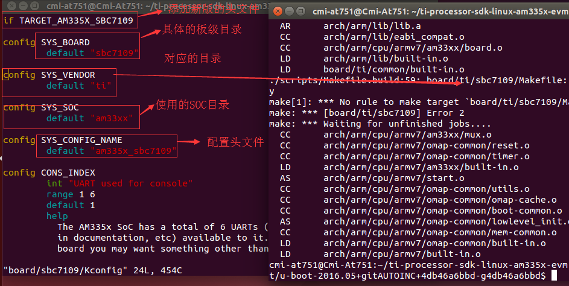
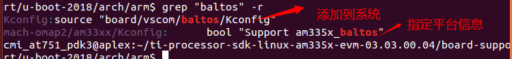
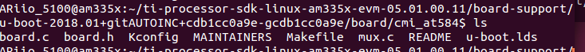
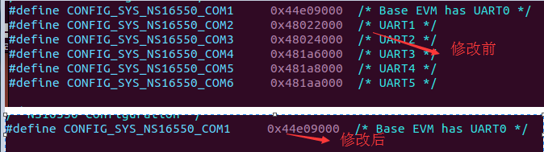
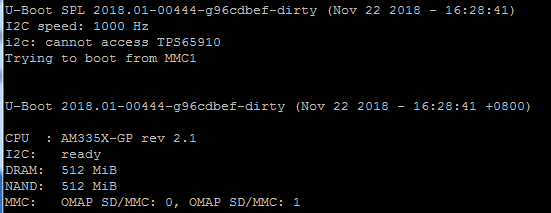
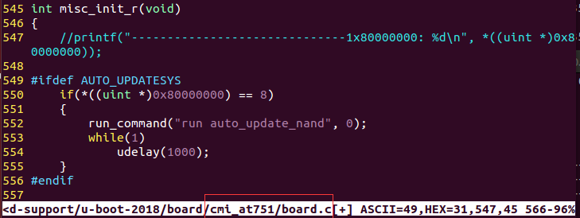
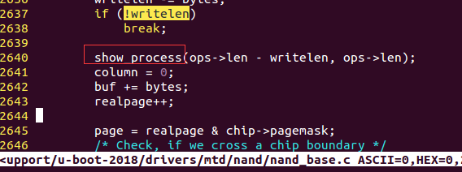
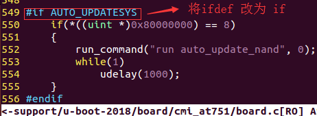
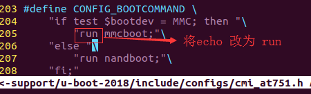

# uboot 编译过程
## 00 目录
* 的三分

## 01 2016版本uboot
* [01 参考地址](http://www.cnblogs.com/chenfulin5/p/6393415.html)
* 02 复制一份板级参考文件
<div>
    &nbsp;&nbsp;&nbsp;&nbsp;&nbsp;&nbsp;&nbsp;board/vscom/baltos/包含nand启动和SD卡启动，同时也是am335x系列，我们以此为例。将board/vscom/baltos/ 复制为board/sbc7109 文件夹，修改board/sbc7109/Kconfig 里面的内容。

```sh
    cat board/sbc7109/Kconfig
    if TARGET_AM335X_SBC7109   // 目标机器宏，在defconfig里面确定机器

    config SYS_BOARD            //指定你的board 文件
        default "sbc7109"

    config SYS_SOC              //指定你的 soc 文件
        default "am33xx"

    config SYS_CONFIG_NAME        //指定你的 include/configs/am335x_sbc7109.h 为配置头文件
    default "am335x_sbc7109"

    config CONS_INDEX
    int "UART used for console"
    range 1 6
    default 1
    help
      The AM335x SoC has a total of 6 UARTs (UART0 to UART5 as referenced
      in documentation, etc) available to it.  Depending on your specific
      board you may want something other than UART0.

    endif
```


</div>

* 03 将板级文件添加到系统中
<div>&nbsp;&nbsp;&nbsp;&nbsp;&nbsp;&nbsp;&nbsp;1. 将board/sbc7109/Kconfig 添加到arch/arm/Kconfig

```sh
  source "board/sbc7109/Kconfig"
```
&nbsp;&nbsp;&nbsp;&nbsp;&nbsp;&nbsp;&nbsp;&nbsp;&nbsp;&nbsp;&nbsp;&nbsp;&nbsp;&nbsp;2. 在arch/arm/Kconfig 里面添加如下内容：
```sh
  377 config TARGET_AM335X_SBC7109        //这个宏就是上面那个 if TARGET_AM335X_SBC7109 的前置条件                                          
  378     bool "Support am335x_sbc7109"                                               
  379     select CPU_V7                                                               
  380     select SUPPORT_SPL                                                          
  381     select DM                                                                   
  382     select DM_SERIAL                                                            
  383     select DM_GPIO     
```
</div>

* 04 添加板级文件的头文件

```#!/bin/sh
复制 include/configs/baltos.h 为include/configs/am335x_sbc7109.h
修改include/configs/am335x_sbc7109.h 里面的一个宏定义：
    #define CONFIG_SYS_LDSCRIPT     "board/sbc7109/u-boot.lds"

```
* 05 指定链接文件
<div>
修改board/sbc7109/u-boot.lds 里面的一个内容

```#!/bin/sh
  34     .text :                                                                     
   35     {                                                                           
   36         *(.__image_copy_start)                                                  
   37         *(.vectors)                                                             
   38         CPUDIR/start.o (.text*)                                                 
   39         board/sbc7109/built-in.o (.text*)                                       
   40         *(.text*)                                                               
   41     }     
```
</div>

* 06 添加xxx_defconfig文件
<div>
&nbsp;&nbsp;&nbsp;&nbsp;&nbsp;&nbsp;&nbsp;复制 configs/am335x_baltos_defconfig 为 configs/am335x_sbc7109_defconfig

```#!/bin/sh
修改configs/am335x_sbc7109_defconfig 里面的内容,如下：
  将 CONFIG_TARGET_AM335X_BALTOS=y  替换为：
  CONFIG_TARGET_AM335X_SBC7109=y
```
</div>
* 07 修改信息记录（可做可不做）

```#!/bin/sh
修改对应board/sbc7109/MAINTAINERS 里面的内容
    BALTOS BOARD
    M:  Yegor Yefremov <yegorslists@googlemail.com>
    S:  Maintained
    F:  board/sbc7109/
    F:  include/configs/am335x_sbc7109.h
    F:  configs/am335x_sbc7109_defconfig

```
* 08 编译

```#!/bin/sh
make am335x_sbc7109_defconfig O=out all -j20

```

## 02 2018版本uboot
<div>
&nbsp;&nbsp;&nbsp;&nbsp;&nbsp;&nbsp;&nbsp;18版本的uboot需要在16版本的基础上做调整才能正常使用。现在以将16版本at751的版本文件添加到18版本为例进行讲解。
</div>

* 01 依据16版本参考文档建立18版本的板级文件
* 02 将板级文件注册到uboot系统中
<div>&nbsp;&nbsp;&nbsp;&nbsp;&nbsp;&nbsp;&nbsp;注意：在2018版本的uboot中，将板级文件注册到系统中需要两步，如下图所示

</div>


* 03 用uboot-2016版本的751的板级文件替换cmi_at584的板级文件
```#!/bin/sh
  cp  /board/cmi_at751/*     /board/cmi_at584 -rf
```


* 04 在board.c文件中修改代码
```#!/bin/sh
  使用 ”:%s/old/new/g“  将 setenv 改为env_set，将getenv改为env_get
```

* 05 将自己的751xx.h拷贝到include/configs/cmi_at584.h
```#!/bin/sh
  cp 751xx.h include/configs/cmi_at584.h
```

* 06 去掉 cmi_at584.h相关宏定义
```#!/bin/sh
  对比baltos.h文件，去掉 cmi_at584.h文件中多余的宏定义，只保留baltos.h中定义的宏定义，因为这些宏定义已经被定义过了，我们根据需要在make menuconfig中选择即可。
```

* 07 板级参考文件

```#!/bin/sh
    7.1 第一个板级参考文件：
    make pengwyn_defconfig      
    silica/pengwyn/board.c
    include/configs/pengwyn.h
    可以SD卡启
    1. 修改ddr的参数配置，一般将配置为DD3的参数即可（采用默认的即可启动）
    2. nand参数配置，仿照151的nand参数配置，将pengwyn.h中的nand的参数改为151的即可
    3. 上电启动进入uboot
```
```#!/bin/sh
    7.2第二个板级参考文件：
    make am335x_baltos_defconfig
    board/vscom/baltos/
    include/configs/baltos.h
    这个板级文件如果要是直接编译的话，则系统会重复执行 MLO这个文件，解决办法：
    在 baltos.h 删除一下宏定义：
    #define CONFIG_SYS_NS16550_COM2     0x48022000  /* UART1 */
    #define CONFIG_SYS_NS16550_COM3     0x48024000  /* UART2 */
    #define CONFIG_SYS_NS16550_COM4     0x481a6000  /* UART3 */
    #define CONFIG_SYS_NS16550_COM5     0x481a8000  /* UART4 */
    #define CONFIG_SYS_NS16550_COM6     0x481aa000  /* UART5 */
```



<div>
  编译运行：make am335x_baltos_defconfig all -j20 O=out
(注意：18版本的uboot不再支持nandecc，在xxx.h文件中将nandecc相关的命令语句去掉即可)

  
</div>
<br>


* 08 在uboot中获取启动设备的编号





* 09 在uboot中添加nand烧写进度条

```sh
在drivers/mtd/nand/nand_base.c 文件中添加如下函数：
static void show_process(unsigned long a, unsigned long b)
{
  static int last_percent = 100;
  int percent = 0;

  percent = a / (b / 100);

  if (percent != last_percent)
  {
      printf("\r%02d%% complete", percent);
  }
  else
  {
      printf("\n");
  }
}
```

    然后在 nand_do_write_ops 函数中调用上述函数


* 10 制作uboot2018[补丁文件](u-boot-2018_cmiat751.parth)
```#!/bin/sh
注意补丁文件是以cmi_at751为模块
diff -uNr u-boot-2018 u-boot-2018_cmiat751 > u-boot-2018_cmiat751.parth
补丁的使用:
cp u-boot-2018_cmiat751.parth u-boot-2018
cd u-boot-2018
patch -p1 < u-boot-2018_cmiat751.parth
注意：上述补丁文件有两处错误：修改如下图：
```





```#!/bin/sh
  编译：
  make cmi_at751_defconfig all -j20 O=out
```
## 03 源代码
```#!/bin/sh
  1. githup:git://git.ti.com/ti-u-boot/ti-u-boot.git
  2. sdk:http://www.ti.com/tool/processor-sdk-am335x
  3. 下载指定的版本：http://software-dl.ti.com/processor-sdk-linux/esd/AM335X/03_03_00_04/index_FDS.html
```
